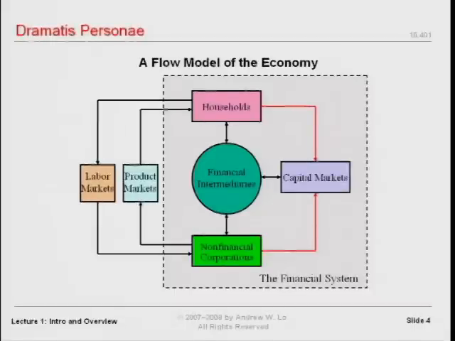
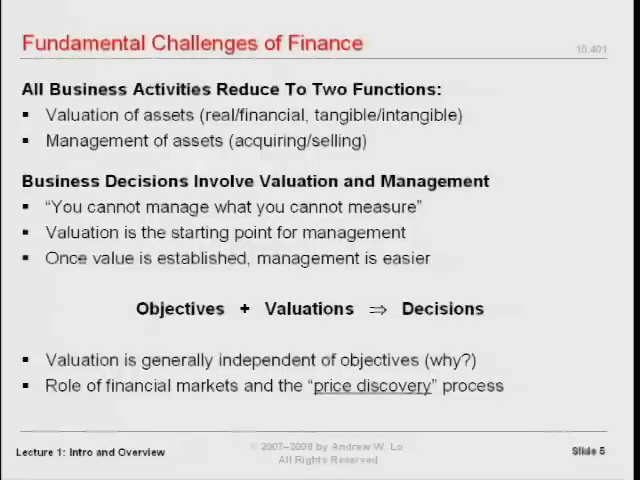
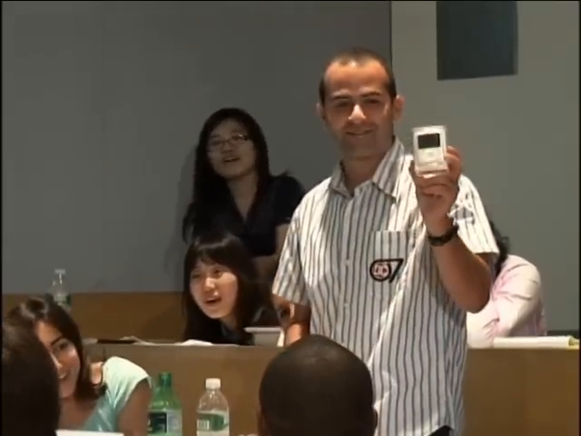
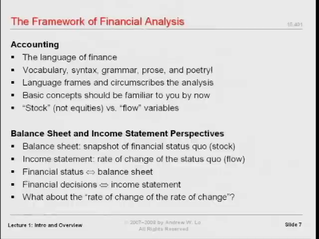
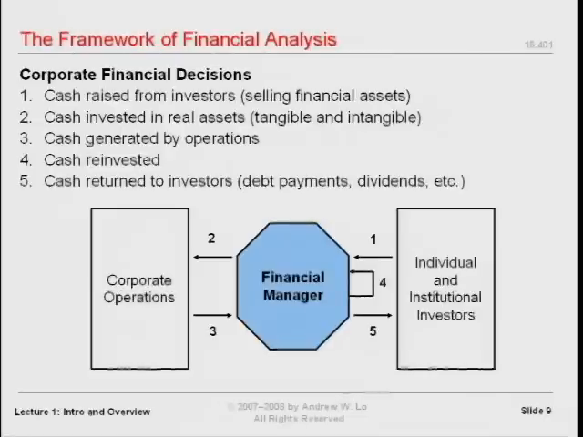
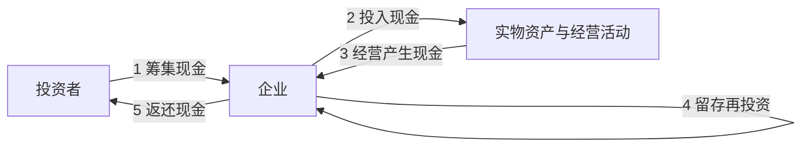
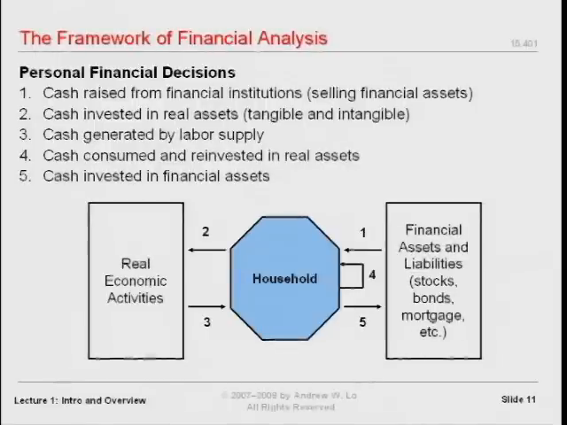
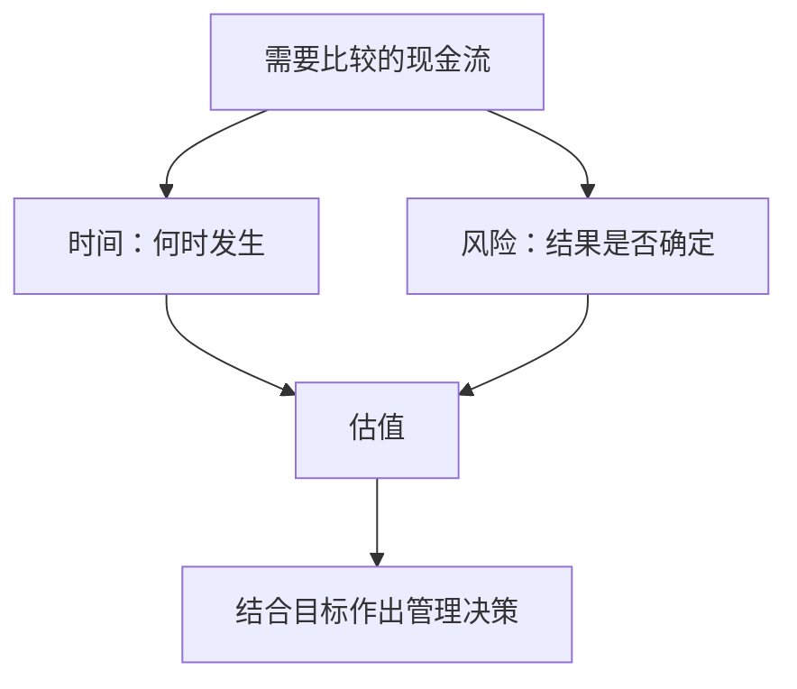
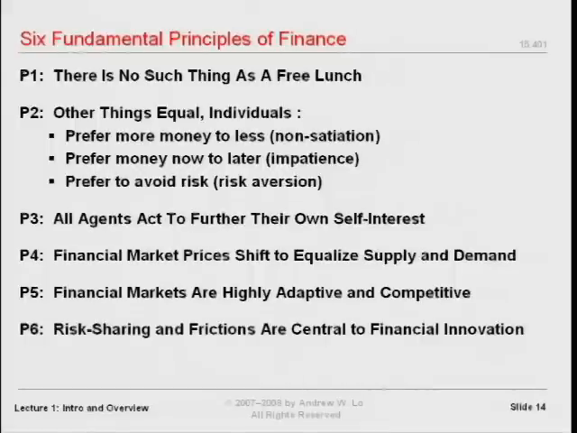
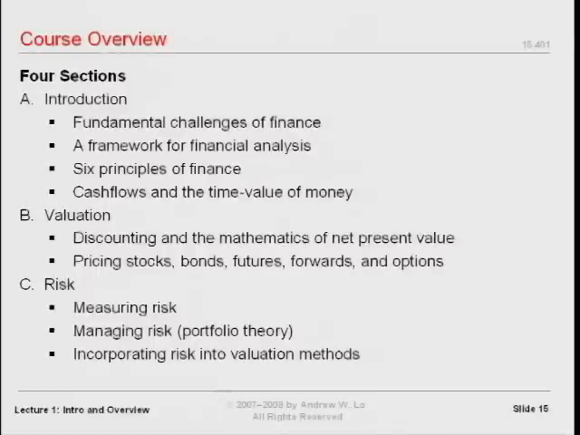

# 金融理论入门：估值、现金流、时间与风险

> MIT 15.401《Finance Theory I》第一讲 · Andrew W. Lo（罗闻全） · 2008 年秋季  
> 原视频：[*Ses 1: Introduction and Course Overview*](https://www.youtube.com/watch?v=HdHlfiOAJyE) · 67 分 12 秒  
> 本书依据整讲英文字幕、课堂画面及[官方第一讲幻灯片](https://ocw.mit.edu/courses/15-401-finance-theory-i-fall-2008/6445d784e4bacb5a5b0fee96716bc084_MIT15_401F08_lec01.pdf)译编。人物、市场事件、金额及课程安排均置于授课当年的语境中。

金融分析的任务，可以归结为两个问题：**一项资产值多少，以及在既定目标下应该如何管理它。** 时间和风险让这两个看似简单的问题变得困难。理解现金流如何流动、何时发生、承担什么风险，就有了理解个人理财、投资管理和企业决策的共同起点。

本讲先解释学习金融的理由，再通过一次真实的课堂拍卖展示价格如何形成，随后建立企业和家庭都能使用的分析框架，最后介绍基本原理与课程学习方法。

## 一、为什么金融是一门管理的基础语言

**对应视频：00:00:26—00:10:41。**

这门课面向 MBA 一年级学生，包括准备进入金融行业的人，也包括尚未决定职业方向、只是希望了解金融的人。Lo 的目标并不是让所有学生都成为金融从业者，而是让大家理解：金融知识会影响几乎所有需要权衡资源和结果的管理决策。

在介绍自己时，他回顾了在耶鲁学习经济学、在哈佛获得经济学博士学位、在沃顿任教以及此后在 MIT 金融学组工作的经历。他反复强调，金融既可以在研究上非常严谨、充满智力挑战，也可以直接用于现实管理。这种理论与实践之间的联系，正是他选择这一领域的原因。

### 第一次尝到金融的“滋味”

Lo 用小儿子第一次吃冰淇淋的故事形容接触新学科的体验：一个原本极度挑食的孩子，在几秒钟内从嫌弃转为好奇，再到着迷。他希望初学者也能经历类似的变化——从觉得金融陌生，到看见它如何解释真实问题。

他还提出一个带有玩笑意味的教学评价办法：与其在学期末评价课程，不如五年后再评价。等学生真正进入职业生涯，才更容易判断某套知识能否持续改善决策。课程的价值，最终要由学生日后的使用来检验。

### 数学基础与课程起点

这是一门入门课，不要求学生事先掌握高等数学、计算机或定量分析。课程会从共同的基本概念出发。不过，“入门”并不意味着不需要投入：许多金融思想与日常直觉不同，需要反复练习才能内化。

本讲给出的路线是：先认识经济中的参与者，再理解估值和管理两个任务，建立分析框架，最后把时间与风险放入其中。接下来 13 周的内容，都可以放回这条主线上理解。

## 二、金融等于“数学加金钱”吗？三种不同的实践

**对应视频：00:10:44—00:21:24。**

Lo 用一个有意简化的表达开启讨论：

**金融 = 数学 + 金钱。**

这里的“数学”范围很宽：一端可以是微分几何、偏微分方程，另一端可以只是算术和中学代数。重点不在于一律使用复杂工具，而在于对涉及金钱的交易进行系统、严谨的分析。

### James Simons：高度定量化的投资

James Simons 原本是一位微分几何学家，曾担任石溪大学数学系主任，并与陈省身共同发展了 Chern-Simons 理论。Lo 介绍他时，先谈的是数学背景，再谈其创办的 Renaissance Technologies。

在课堂叙述中，这家投资管理公司聚集了数学、物理、计算机等领域的博士，方法高度保密，却创造了非常突出的投资业绩。Lo 引用当时的行业报道，称 Simons 在 2006 年的个人收入达到 **17 亿美元**，并特意提醒学生区分“某一年的收入”与“一个人的财富”。

这个例子说明，复杂数学可以服务于金融分析，但它只是金融实践的一种形态。

### 沃伦·巴菲特：财务报表与估值判断

另一端是巴菲特。Lo 引述 2008 年福布斯的排名，提到当年 2 月约 **620 亿美元**的财富估计。他着重描述的不是复杂模型，而是一个规模很小的团队，持续阅读企业资料、利润表和资产负债表，进行估值判断。

“使用基础算术”不等于“工作简单”。真正困难的部分，是看懂数字、理解业务，并判断这些数字意味着什么。两个人都在做金融分析，但使用的数学和组织方式很不一样。

### 杰克·韦尔奇：企业经营中的财务决策

第三位人物是杰克·韦尔奇。他接受工程学训练，在 1960 年加入通用电气，1981 年成为 CEO。Lo 给出的课堂数据是：公司年营业收入从接任时约 **260 亿美元**，增长到 2001 年任期结束时约 **1,300 亿美元**。他也提到，任职初期员工人数从约 40 万降至 30 万，以及由此产生的“中子弹杰克”绰号。

Lo 用这个案例强调的能力，是判断投资、控制成本、理解财务数字，并据此作出经营决策。韦尔奇的作用不在于亲自使用博士阶段的技术工具，而在于理解财务语言。

> 数字校读：讲者随后口头说“达到原来的四倍半”，但按同一段给出的 260 亿与 1,300 亿计算，后者是前者的 5 倍。英文订正稿和逐段译稿保留原话；此处明确区分口头说法与算术关系。

| 人物 | 课堂强调的工作方式 | 共同基础 |
| --- | --- | --- |
| James Simons | 定量研究、数学与计算工具、研究团队 | 理解金融逻辑与价值 |
| 沃伦·巴菲特 | 阅读公司资料和财务报表，判断估值 | 理解金融逻辑与价值 |
| 杰克·韦尔奇 | 判断投资、成本及企业资源配置 | 理解金融逻辑与价值 |

这三个例子不是“修完一门课就能复制成功”的承诺。Lo 的意思是：背景、职业和方法可以不同，对金融基本概念的理解却是重要的共同条件。

## 三、金融体系中的四类参与者

**对应视频：00:21:27—00:22:57。**

本课程重点研究四个组成部分：

1. **家庭**：从个人与家庭的角度处理收入、消费、储蓄及资产负债。
2. **金融中介机构**：处于金融交易和资金配置过程之中的机构。
3. **非金融企业**：从事实体经营，也必须作出投资和融资决策。
4. **资本市场**：各类金融资产交易与定价的重要场所。

经济还包括劳动市场、产品市场等。Lo 并未否认这些市场的重要性，而是根据课程时长，把注意力集中在上述四个部分。

学习时应当留意：同一套分析原则换到不同参与者身上，术语和应用可能发生变化，底层逻辑却相通。企业的融资决策和家庭的借款安排，看起来属于不同问题，实际上都涉及现金流、时间、风险与目标。

## 四、金融分析的两个任务：估值与管理

**对应视频：00:23:01—00:26:03，以及 00:35:45—00:38:14。**

### 先确定价值，再作出选择

第一个任务是**资产估值**，第二个任务是**资产管理**。在一个已经明确目标、并且能够比较各方案价值的框架中，管理就是选择更有助于实现目标的方案。

课堂用一句话概括这个关系：

**目标 + 估值 → 决策。**

这并没有消除管理的难度，而是指出难度主要落在哪里：首先要弄清目标，然后要知道比较的究竟是什么价值，以及这个价值是如何得到的。

### 水与钻石：有用不等于昂贵

水是生命所必需的，却通常不昂贵；钻石并非生存必需，却可能极其昂贵。这个对照迫使我们区分日常语言中的“很重要”“很有用”和交易情境中的“值多少钱”。

本讲没有在这里完整推导水与钻石的价格，而是借此提醒：**讨论估值，必须先明确价值的含义和分析情境。**

### 估值问题与管理问题各在问什么

| 估值问题 | 管理问题 |
| --- | --- |
| 金融资产实际上如何定价？ | 应该储蓄多少、消费多少？ |
| 它们应该如何定价？ | 应该买什么、卖什么？ |
| 实际定价与应有定价是否一致？ | 何时买入或卖出？ |
| 金融市场在哪些意义上运作良好？ | 如何为交易筹资？ |

Lo 预计课程前三分之二主要研究估值，后三分之一把这些思想用于资本预算、风险管理等管理问题。同样的提问既可以指向企业，也可以指向个人生活。

## 五、一个密封礼盒如何得到 45 美元的价格

**对应视频：00:26:03—00:35:41。**

这场课堂拍卖是本讲最具体的实验。它把“价格发现”从抽象名词变成了学生亲自参与的过程。

### 第一步：随机选择拍卖物品

Lo 为两个班各准备了一件物品。为了避免偏袒某个班，他请一位学生在两张纸上分别写“正面”和“反面”，反扣、打乱，再分别放在两个包裹前。另一位学生抛硬币，决定当前班拍卖哪一件。

随机化解决的是两个班之间的分配问题。选定之后，盒子仍然是密封的，学生不知道其中内容。

### 第二步：明确规则与已有信息

有人猜价值为零，也有人说可能是负数。Lo 以本次交易的有限责任为由，说明购买者不会因为盒子里的东西而反过来承担额外欠款，因此先确立一个零下限。

随后，他强调这是真实拍卖：出价意味着愿意支付，课后必须用现金结算。有人问钱归谁，他回答归自己，用来补偿购买教具的支出，并非慈善拍卖。

这些细节都属于交易环境。它们决定参与者怎样理解自己报出的价格。

### 第三步：通过竞价形成成交价

出价从 1 美元开始，逐渐升至 10、20、30 美元，随后又出现 31、35、40、45 美元的报价。有人询问能否做空，Lo 明确拒绝。在没有人愿意出到 50 美元时，礼盒以 **45 美元成交**。

这时，一个可以用于分析的数字已经形成，但谁也还没有看过盒子里的东西。Lo 因而追问：这个数字是怎样产生的？为什么停在 45，而不是 50？

### 第四步：拆开礼盒，区分成交与信息

礼盒打开后，里面是一台 **4 GB 版 iPod nano**。Lo 说它当时的零售价是 **149 美元**。

对买家来说，45 美元买到这件物品很划算；对卖家来说，没有收回希望得到的 149 美元。但如果卖家的目标是立刻把一个内容不透明的盒子卖出去，市场确实完成了这个任务，而且产生了正的成交收入。

> 数字校读：讲者把 45 美元称作大约三分之一的价值，并口头提到约 66% 的折价。以 149 美元作比较基准，45 ÷ 149 约为 30.2%，对应折价约 69.8%。这只是对课堂给定数字的核算，不改变实验要说明的信息问题。

### “不知道盒内物品”并不等于“没有信息”

学生不能触摸、摇晃或检查盒内物品，但仍然掌握一些线索：包装大小、讲者是一位教授、欺骗学生可能带来的声誉与院内约束，以及课堂拍卖的具体规则。

因此，出价是在有限信息下形成的，并非在真正的真空中形成。Lo 将成交价低于他希望得到的金额，解释为缺乏透明度和物品信息的结果。

本讲据此留下三个需要继续分析的问题：

- 市场如何把参与者的信息和判断转化为价格？
- 一个价格已经形成，是否意味着它就是“正确”的价值？
- 评价市场运作好坏时，应当看卖方收入、买方收益，还是交易能否完成？

这次演示能展示价格发现的过程，却没有在这一讲中分解出各个因素对 45 美元的精确贡献。Lo 正是借此说明，进一步的定量分析为什么必要。

## 六、分析框架的起点：存量、流量与财务报表

**对应视频：00:38:18—00:41:51。**

会计提供了描述利润、亏损、收入、成本等经济概念的词汇和计量起点。Lo 要求学生首先掌握两个概念：**存量（stock）**和**流量（flow）**。

这里的 stock 不是“股票”，而是某个时点的资产水平。flow 则是资产随时间变化的速率。

### 浴缸的比喻

想象一个正在进水的浴缸：浴缸里已经有多少水，是存量；水以多快的速度流入，是流量。熟悉微积分的人，也可以把它理解为一个变量及其对时间的一阶导数。

Lo 回忆，研究生课堂上有人觉得“变量与导数”比浴缸更直观。老师的回应是，各人可以选适合自己的理解方式。真正重要的是，不要把某个时点的数量与一段时间内的变化混为一谈。

| 观察角度 | 浴缸比喻 | 课堂中的会计对应 |
| --- | --- | --- |
| 存量 | 某一时刻浴缸里的水量 | 资产负债表展示某个时点的财务状况 |
| 流量 | 水流入或流出的速度 | 利润表展示一段期间的收入、费用与经营成果 |

### 一张快照不能说明全部经营状况

只知道公司当前有什么资产，以及这些资产对应什么权利或义务，还不够。还要观察一段时间内公司的经营如何产生收入与损失。课堂以季度作为常见的观察期间。

Lo 在这里用简化的语言把会计报表与财富流动联系起来，随后才转入现金流框架。阅读时应保留这一层区别：**利润表中的利润，不应直接当作同额的现金流。** 本讲的重点是“时点与期间”这两种观察方式，以及报表能够支持经营判断。

他把巴菲特再次作为例子：基础报表本身可以很朴素，但从中读出有用信息的能力非常有力量。

## 七、沿着现金走：从企业决策到个人生活

**对应视频：00:41:57—00:47:25。**

### 企业的五个现金流环节

从企业财务决策的角度，Lo 把分析组织为五个环节：

1. 从投资者处筹集现金。
2. 将现金投入实物资产。
3. 经营活动产生现金。
4. 将部分现金用于再投资。
5. 将部分现金返还投资者。

下面的图按课堂这五个环节整理，编号保留了讲者的对应关系：

现金是公司运转的命脉。追踪它，会触及经营中的许多重要环节。不过，拥有数据并不等于已经拥有决策；管理者必须理解数字的含义。

不同岗位从同一张图中提出不同问题。按本讲的编号，管理者的实物投资决策重点落在 **2 和 3**，融资安排关注 **1 和 4**，董事会的分配决策关注 **5**，讲者讨论的风险管理关注 **1 和 5**。这些对应关系用来帮助初学者定位问题，而不是在本讲中穷尽各岗位的职责。

在课程采用的企业分析框架中，股东和管理者的目标是为所有者谋求好的结果，具体表述为最大化股东财富。

### 家庭可以使用同样的框架

Lo 随即要求学生把这张图换成自己的生活。家庭处在劳动等真实经济活动，与金融资产、金融负债之间，同样面对资金如何获得、如何使用的问题。

| 企业框架中的环节 | 课堂给出的家庭对应 |
| --- | --- |
| 筹集资金 | 助学贷款、其他借款、房屋净值贷款 |
| 投入实物资产 | 当前对教育与自身人力资本的投入 |
| 经营产生现金 | 提供劳动、工作取得现金收入 |
| 消费或再投资 | 日常消费，以及对自己、住房、孩子的投入 |
| 配置金融资产 | 储蓄、退休计划等金融安排 |

课堂以美国的 401(k) 计划、退休安排和社会保障权益为例，提醒学生：即使当前可支配资产不多，也已经处在一套金融安排之中。

企业框架使用股东财富目标；个人框架则必须先回答“我希望怎样生活”。接下来才是围绕目标管理实物与金融资产，提高实现目标的可能性。

### 把课程当作与自己有关的事

对每个概念，Lo 都要求学生追问：它怎样改善我的生活？怎样帮助我作出更好的个人决策？当这种思考成为习惯，迁移到职业管理情境就会更自然。

他的要求不是把课堂知识停留在定义上，而是把它用到储蓄、消费、融资、教育投入和风险承担等真实选择中。

## 八、为什么时间和风险决定了金融的难度

**对应视频：00:47:27—00:50:07。**

如果所有现金流都在同一时刻发生，而且结果完全确定，许多问题可以简化为基础的微观经济分析。Lo 因此把时间和风险看成金融学特别需要研究的两个维度。

### 时间：今天的一美元不等于明年的一美元

现金流的日期是其经济含义的一部分。即使名义金额相同，现在收到和以后收到也不能直接视为同一件事。本课程会先用数周建立处理时间的工具，再讨论贴现和净现值。

讲者用“时间只朝一个方向流动”引出一个与物理学有关的课堂预告，并提到会借利率的设定作类比。这一讲并未给出那项论证，因而这里仅保留它作为后续课程的引子。

### 风险：确定的一美元不等于不确定的一美元

即使日期相同，无风险的现金流与带风险的现金流也不同。金额之外，还需要理解获得该金额的不确定性。

Lo 预计，在建立更多工具后再正式引入风险。**把时间与风险结合起来，才进入这门课的现代金融分析框架。**

这张图是对本讲论述的整理。它没有给出任何尚未讲授的定价公式，而是说明后续各种工具要回答什么问题。

## 九、金融基本原理：先建立近似，再理解边界

**对应视频：00:50:13—00:54:49。**

Lo 提出六条基本思想，并在本讲口头解释前三条。他特别强调：这些原理是对复杂现实的近似。先理解标准框架，后续才能判断近似在哪些地方有效、又在哪些地方不足。

### 1. 不存在持续、系统性的免费午餐

“天下没有免费的午餐”是方便记忆的说法。更严谨的意思是：运气好、付出努力时，偶尔可能发现有利机会，但不能期待毫无缘由的财富转移持续、系统地发生。

因此，这条原理并不是宣称所有偶然的好机会都不存在，而是在建立一种不依赖持续无偿获利的分析出发点。

### 2. 其他条件相同时，人们通常有三种偏好

- 钱多于钱少，通常更好；课堂称为**非饱和性**。
- 现在拿到钱，通常优于以后才拿到。
- 在风险定义恰当的前提下，风险较少通常优于风险较多。

这里的关键限定是“其他条件相同”。Lo 承认现实中很难完全满足这个条件，也承认个人可能在特定时刻出现例外。他要表达的是，作为较长时期、较大人群的近似，这些假设通常有用。

### 3. 经济主体会采取行动增进自身利益

这条假设中的“自身利益”，不能简单等同于不顾他人的金钱私利。如果一个人关心他人的福利，帮助他人也可能满足自己的偏好。

Lo 以特蕾莎修女作带有反讽意味的例子，说明经济学家可以把他人的福祉放入一个人的效用之中。他同时指出，这种定义有时接近同义反复；金融分析需要进一步把偏好变成可以具体讨论的决策结构。

### 4—6. 价格调整、市场适应与金融创新

官方第一讲幻灯片第 14 页列出了完整的六条原理。其余三条是：

| 编号 | 幻灯片中的原理 |
| --- | --- |
| 4 | 金融市场价格会调整，使供给与需求相等。 |
| 5 | 金融市场具有高度适应性和竞争性。 |
| 6 | 风险分担与摩擦是金融创新的核心。 |

这里补录的是配套课件列示的命题。讲者没有在本讲口头逐条展开，因此本书也不把它们扩写成已经完成论证的结论。特别是第五条的表述是“适应性和竞争性”，不应擅自替换成“市场价格永远正确”。

### 原理的作用与局限

讲者计划先使用标准框架，最后一讲再回过头来讨论市场的不完美、理论中的近似及其漏洞。

学习这些原理的方式，应当同时包括两步：先掌握它们如何帮助分析，再问清它们依赖哪些条件。把近似当作无条件成立的断言，会错过本讲反复强调的限定。

## 十、课程地图与学习方法

**对应视频：00:54:53—01:07:08。**

### 四个部分把“时间”和“风险”逐渐合起来

| 部分 | 本讲给出的内容 | 与整体框架的关系 |
| --- | --- | --- |
| A：导论 | 本讲的参与者、任务与分析框架 | 建立共同语言 |
| B：估值 | 贴现、净现值，股票、债券、期货、远期与期权的定价 | 建立估值工具，先处理时间 |
| C：风险 | 把风险引入前面的框架 | 将时间与风险结合 |
| D：公司金融应用 | 把原理用于实际企业决策 | 从估值走向管理 |

最后一讲会整合全课程，并讨论理论与市场不完美之间的关系。

### 当年的考核安排

本讲要求学生按指定清单阅读 Brealey、Myers 和 Allen 的教材，而不是读完整本书。眼前的阅读任务是第一、二章。出勤、准备和讨论也是课程的一部分。

| 考核项目 | 占比 |
| --- | ---: |
| 案例分析书面报告 | 10% |
| 出勤与课堂参与 | 10% |
| 期中考试 | 25% |
| 期末考试 | 55% |

期末考试权重较大，一方面因为它是综合性考试，覆盖更多内容；另一方面因为学生需要时间适应金融分析。Lo 说，很多人要到学期后段，才会真正把前面的知识联系起来。

这些安排属于视频所记录的 2008 年课程。教师之间协调了不同班级的主要评分机制，但部分课堂材料仍会随授课风格而有所不同。

### 自愿做题不等于可以不练习

课堂不要求每周上交习题，而是提前提供大量题目和答案。Lo 承诺，当年考试超过一半的分值会直接来自这套题库。习题课会讲解选定题目，他也会在课堂演示较难的问题，但学生仍需自行完成更多练习。

这套安排的目的，是减少重复收交作业的负担和对考试的焦虑，把练习节奏交给学生。它没有改变学习本身的要求：**学习金融分析，必须亲自做分析。**

Lo 把这说成“金融不是一项观赏性运动”。听懂一次讲解，并不保证独立面对新问题时就会应用。

### 课前、课中、课后各做什么

1. **课前浏览讲义。** 不必提前吃透全部内容，但至少知道将要讨论什么。
2. **课中主动记笔记。** 讲义是刻意不完整的；要记下自己对推理和概念的理解。
3. **课后回顾并消化。** 区分“听见了”“理解了”和“能够使用”。
4. **既合作，也独立做题。** 小组讨论有帮助，但不能据此假定自己能独立完成；考试要求个人作答。
5. **持续提问并联系实际。** 只要与课程相关且时间允许，个人贷款等现实问题也可以成为讨论对象。

Lo 还介绍了当年新开设、从 9 月 17 日开始的非学分研讨课 *The Practice of Finance*，用于讨论金融行业的实务与职业问题。这里的意义，是提醒学生把理论与实践联系起来。

在结束前，他再次要求学生把课程看作与自己有关的事情。每学到一个概念，就尝试说明它怎样改变一个真实决策：先确定目标，识别现金流，分清存量与流量，再处理时间和风险。

## 回看索引与术语

### 关键片段

| 时间 | 内容 |
| --- | --- |
| [00:00:26](https://www.youtube.com/watch?v=HdHlfiOAJyE&t=26s) | 课程定位、金融与管理 |
| [00:11:17](https://www.youtube.com/watch?v=HdHlfiOAJyE&t=677s) | “数学加金钱”与三位人物 |
| [00:21:27](https://www.youtube.com/watch?v=HdHlfiOAJyE&t=1287s) | 金融体系四类参与者 |
| [00:23:01](https://www.youtube.com/watch?v=HdHlfiOAJyE&t=1381s) | 估值与管理 |
| [00:26:03](https://www.youtube.com/watch?v=HdHlfiOAJyE&t=1563s) | 密封礼盒拍卖 |
| [00:38:18](https://www.youtube.com/watch?v=HdHlfiOAJyE&t=2298s) | 存量、流量与会计框架 |
| [00:41:57](https://www.youtube.com/watch?v=HdHlfiOAJyE&t=2517s) | 企业与家庭现金流 |
| [00:47:27](https://www.youtube.com/watch?v=HdHlfiOAJyE&t=2847s) | 时间与风险 |
| [00:50:13](https://www.youtube.com/watch?v=HdHlfiOAJyE&t=3013s) | 金融基本原理 |
| [00:54:53](https://www.youtube.com/watch?v=HdHlfiOAJyE&t=3293s) | 课程结构、考核与学习方法 |

### 核心术语对照

| 英文 | 本书译法 |
| --- | --- |
| valuation | 估值 |
| price discovery | 价格发现 |
| financial intermediaries | 金融中介机构 |
| non-financial corporations | 非金融企业 |
| stock / flow | 存量／流量；证券语境中的 stock 另译“股票” |
| balance sheet / income statement | 资产负债表／利润表 |
| cash flow | 现金流 |
| real assets / financial assets | 实物资产／金融资产 |
| capital budgeting | 资本预算 |
| discounting / net present value | 贴现／净现值 |
| non-satiation | 非饱和性 |
| utility function | 效用函数 |

原始字幕中有三处简短的学生发言标为听不清，分别在 00:30:10、00:33:39 和 00:45:29。译稿保留了标记；它们不影响拍卖结果和主干论证。授课中的幽默、历史性陈述与当年课程安排，均按其课堂语境理解。
