# 现值关系（一）：把资产还原为现金流

> MIT 15.401《金融理论 I》· 2008 年秋季 · 第二课  
> 讲者：Andrew W. Lo · 原视频：*Ses 2: Present Value Relations I* · 时长：1 小时 15 分 55 秒  
> 根据平台英文字幕订正、逐段翻译并编排。本文中的“今天”“这个周末”和时事判断均指授课时的 2008 年背景。  
> [观看原视频](https://www.youtube.com/watch?v=U03Md5enU-0) · [MIT OCW 课程](https://ocw.mit.edu/courses/15-401-finance-theory-i-fall-2008/)

一项资产（asset）为什么有价值？最直觉的回答可能是：因为它是一家企业、一栋房子、一项专利（patent），或者一个知名品牌。本课要求我们进一步追问：拥有它以后，在什么时间，能收到或必须付出多少钱？

这一步把各种外形迥异的资产放进同一个分析框架。企业、债券、专利、声誉乃至负债，都可以用现金流（cash flow）序列描述。接下来的估值任务，是把这些不同日期的金额换算到同一个日期，再求和。

本课的核心视角是：**不同日期的钱，就像不同国家的货币。** 日元不能未经换算就与英镑相加，明年的美元也不能未经换算就与今天的美元相加。贴现因子（discount factor）承担跨期兑换率（exchange rate）的作用，现值（present value）就是以今天的货币为计价基准（numeraire）得到的价值。

[TOC]

## 1. 包裹拍卖：价值取决于买家掌握的信息

*视频定位：00:20—03:05。*

上一课，Lo 将包装好的物品拿到课堂上拍卖。两个班看到的包裹大小不同，也拿到了不同的物品。这一课开头，他公布了另一个包裹的内容，并比较成交结果。

| 物品 | 课堂成交价 | 课堂提到的零售价 | 结果 |
| --- | ---: | ---: | --- |
| 较小包裹中的 iPod | 45 美元 | 150 美元 | 成交价约为零售价的 30% |
| 较大包裹中的对冲基金著作 | 60 美元 | 45 美元 | 买家支付了高于零售价的金额 |

Lo 开玩笑说，书上有他的签名，可能反而降低转售价值。但拍卖要说明的问题很严肃：买家不知道盒子里装的是什么，就无法把价格估得准确。

学生问，另一班是不是得到了内幕信息。Lo 的解释是，他故意准备两种不同物品，并展示两个不同大小的包裹，尽量避免相同物品在两个班之间产生信息外溢。他认为，包裹大小本身可能影响了判断。

这不是一个“市场总能找出正确价值”的证明。它说明，市场能形成一个交易价格，但这个价格依赖参与者知道什么、担心什么，以及愿意承担多少未知风险。

## 2. 2008 年的课堂现场：房利美与房地美

*视频定位：03:05—19:06。*

### 2.1 二级市场如何帮助贷款继续发放

这堂课开始前的周末，美国政府接管了房利美（Fannie Mae）和房地美（Freddie Mac）。Lo 用这一正在展开的事件说明，金融工具并不是脱离现实的公式。

两家公司被称为政府支持机构（government-sponsored entities，GSEs）。按课中的描述，它们以私人公司的形式运营，有首席执行官、董事会和私营部门的薪酬安排，同时承担促进住房融资的政策使命。在政府介入以前，政府究竟会在多大程度上为它们作后盾，存在模糊空间。

课堂首先讨论了它们在抵押贷款二级市场中的作用：银行发放抵押贷款后，可以把相应债权出售给这类机构，回收资金，再继续发放贷款。贷款不必始终留在最初发放它的银行里。

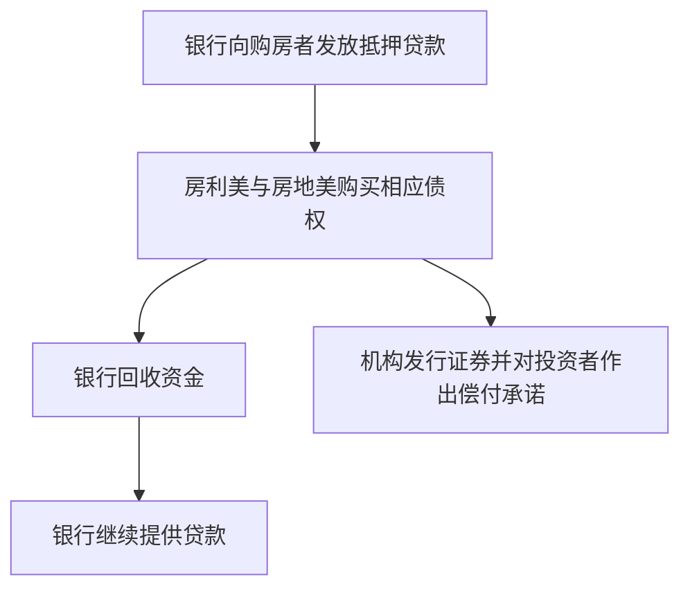

这张图按课堂讲解整理。讨论的具体案例是住房融资；讲者还将“通过二级市场释放放贷能力”放在更广的消费信贷背景中解释。

当住房市场转差，原始贷款所带来的现金流（cash flow）受到压力，影响会沿着整个金融体系传递。两家机构一方面对证券持有人作出了支付承诺，另一方面，支持这些承诺的资金流入却在减少。市场参与者意识到问题后，它们再筹集资金也变得困难。

### 2.2 为什么未知的证券会像未知的包裹

Lo 将眼前的危机与 iPod 拍卖联系起来：价值 150 美元的物品，在买家不知道内容时只卖了 45 美元。如果包裹里换成房利美或房地美发行的证券，买家又不知道未来能拿到什么，也不确定发行人两年后是否还存在，那么价格可能更低。

这里的不确定性（uncertainty）具有层次：买家不知道；卖家也不知道；买家还知道卖家不知道。缺少可信信息会同时影响估值、成交价格和融资能力。

学生问，政府是否还有别的选择。Lo 当时的判断是，行动空间已经很有限。如果等到承诺无法兑现、市场开始大范围失序以后再处理，局面可能更难修复。他也明确指出，是否有效需要进一步观察市场数据，而不是仅凭政策宣布作出结论。

### 2.3 政府支持有成本，也有代际分配问题

讨论政府如何提供支持时，Lo 先用“政府拥有印钞机”的说法解释货币支付能力。随后他立刻补充：这并不意味着支持是免费的，也不只是印钞的问题。

一方面，如果过度发行货币而缺乏支持，可能引发购买力和通胀（inflation）方面的担忧。另一方面，拿来支持金融工具的钱，无法同时用于其他用途。即便支出通过借债安排，成本也不会消失，只是需要追问最终由谁承担。

他说，美国纳税人将承担相关负担，但“纳税人”不是一个不分时间的整体：是这一代、下一代，还是更后面的世代？这已经涉及成本在时间上的分配。课堂关注的另一点，是初始规模可控的支持措施会不会因连锁反应而扩大。

### 2.4 股东与债务证券持有人是两组人

学生追问，政府介入是否意味着所有投资者都得到了保护。Lo 区分了两类参与者：

| 参与者 | 持有什么 | 课堂讨论的结果 |
| --- | --- | --- |
| 公司股东 | 房利美或房地美的股票 | 股东权益（shareholders' equity）已大幅缩水，可能损失大部分投入资本 |
| 与机构交易的证券持有人、债权人 | 机构发行的欠条及其他金融工具 | 政府支持有助于恢复这些偿付承诺的可信度 |

普通股投资者可能包括养老基金、机构投资者，以及通过退休计划间接持股的个人。政府支持债务承诺，并不等于恢复股东原来的权益价值。

Lo 和学生提到股价大幅下跌，但统计起点不同：学生说的是从前一天开始的跌幅，Lo 说的是相对过去几年峰值的跌幅。**比较数字之前，必须先核对它们是相对哪个时间点计算的。** 本文保留这种区别，不把课堂中未经查证的价格估计当作精确历史数据。

### 2.5 规模、风险管理与成本收益

有关重新回归私人经营的讨论，涉及缩小机构规模。Lo 认为，规模扩张过快、监督不足，可能让机构发展到“大到不能倒”的程度，并允许不恰当的风险管理做法持续。

但他也反对仅凭危机当下的恐慌，把整个住房信贷扩张一概视为没有收益。某些借款人通过贷款买到了原本买不起的住房，并且一直按时还款、改善了生活。当前证券持有人承受的损失，与此前借款人获得的收益，需要一起分析。

这不是课堂对政策成败的最终裁决。它提出了一项分析要求：看清现金流、风险承担者、受益者和成本发生的时间，再讨论政策的净效果。

## 3. 资产的外形很多，价值来源需要追到现金流

*视频定位：19:10—27:55。*

### 3.1 本课的路线

Lo 准备从现金流（cash flow）和资产（asset）开始，定义价值算子（value operator），再讨论货币时间价值。年金（annuity）、永续年金（perpetuity）、复利（compounding）与通胀（inflation）是这一组课程的后续内容；本视频并没有完整展开这些后续主题的公式。

阅读安排是 Brealey、Myers 和 Allen 合著教材的第二、第三章：复读第二章，并配合接下来几堂课阅读第三章。

现金流就是流入或流出的现金。资产则既可以是企业、房地产、厂房和设备，也可以是专利（patent）、研发（R&D）、股票、债券、期权，以及知识和声誉。

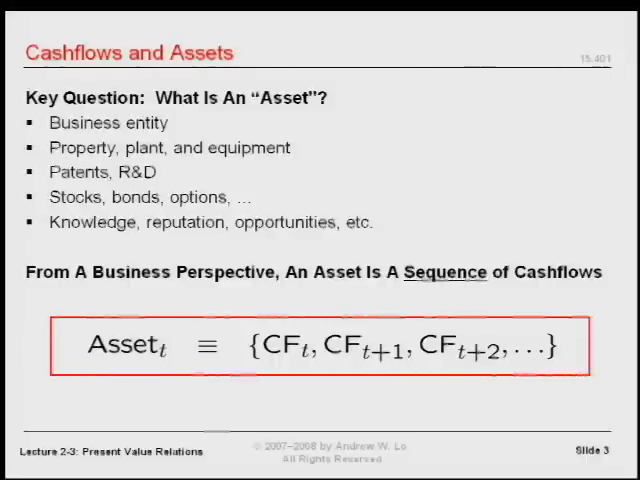

### 3.2 Google 算法、专利和商业秘密

学生以 Google 的算法为无形资产的例子，因为算法可以产生收入。接着，课堂讨论了两条将想法转化为经济价值的路径：专利和商业秘密（trade secret）。

按课堂的概括，专利是在披露技术内容的基础上，取得有限期限内的排他性使用权。其他人要在保护期内使用，就需要获得相应许可。制度用一定期间的独占收益，交换知识的公开与传播。

Lo 以“比如 17 年”作讲解例子。这里保留的是授课时的举例，理解重点在于**保护期限有限、以披露交换权利**，并不把这个数字作为现行专利期限规则。

商业秘密则选择不公开。可口可乐配方是课堂使用的例子：如果企业持续采取措施保密，秘密可能维持很长时间；代价是承担保密失败的风险。课堂还指出，可口可乐的品牌价值与配方秘密的价值不同，二者都是资产，但不能混为同一件事。

| 路径 | 课堂强调的交换关系 | 与融资有关的考虑 |
| --- | --- | --- |
| 专利 | 披露信息，换取有期限的排他权利 | 有可向投资者展示的权利凭证 |
| 商业秘密 | 保留信息，争取持续利用秘密 | 需要保持秘密，也可能难以让外部投资者判断价值 |

学生问，制药公司为什么给 Lipitor 申请专利，而不永远保密。Lo 的回答是：首先看能否守住秘密。其他团队也可能研究同类药物，不能假设只有自己会发现相同的办法。其次，专利还能为融资提供一定的商业可信度：投资者可以知道你拥有哪一项具体权利。

如果你只能告诉投资者“我有一个秘密，但不能告诉你是什么”，就又回到了包裹拍卖：对方不知道自己究竟在为什么东西出价。

## 4. 统一定义：资产是当前和未来现金流的序列

*视频定位：27:55—36:40。*

Lo 在讨论完各种资产（asset）形式之后，要求大家先放下这些分类，采用一个统一定义：

**在时点 t，资产 Aₜ = (CFₜ, CFₜ₊₁, CFₜ₊₂, …)。**

这里的 CF 表示现金流（cash flow），括号表示按时间排序的序列。这个序列包含当前和未来的现金流。

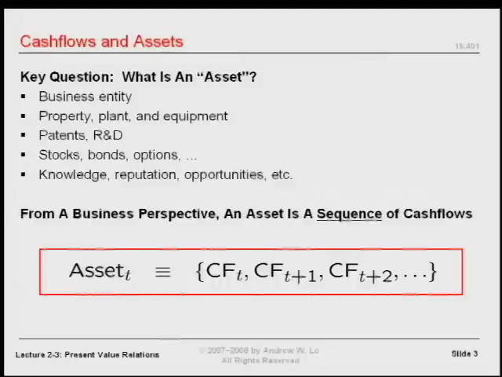

### 4.1 必须说清楚站在哪一个时点

定义里没有过去的现金流。因此，只说“这项资产是可口可乐”还不够，必须说清楚是今天的可口可乐、十年前的可口可乐，还是未来某一时点的可口可乐。

这些时点对应的当前和未来现金流不同，所以，在这个分析框架中，它们是不同的资产。Lo 用“不能两次踏入同一条河”来帮助理解：河水不断流动，资产的未来现金流也随时间和条件变化。

房利美（Fannie Mae）和房地美（Freddie Mac）的股票，五年前与授课当时的现金流前景明显不同。名称没有改变，并不意味着估值面对的现金流序列没有改变。

过去没有被放进序列，表示它不是今天待估现金流的一部分。这个定义并不要求忽略用来判断未来的历史信息，而是明确估值对象所在的时间位置。

### 4.2 序列还不是总和

学生问：这是一个序列，而不是求和吗？Lo 强调，确实如此。

在定义资产时，我们只是列出各个日期的现金流，还没有把它们合并成一个数字。现金流的时间顺序不能丢；即使未来的数额尚未知道，也可以先用符号表达它们，承认这个序列作为抽象对象存在。

定义资产和为资产估值，是两个步骤。前者告诉我们输入是什么，后者才负责把输入变成一个价值数字。

### 4.3 负数、零和共同现金流都可以出现

现金流不必全为正数。它可以是正数、负数或零，只需作为实数来处理。

如果一串现金流都是支出，日常语言可能把它叫作负债，但本课可以继续用同样的现金流框架分析它。如果一项专利（patent）没有产生增量现金流，零、零、零这样的序列在数学上仍然成立，因此“零资产”也可以属于这个定义。

不同资产之间也可以有共同的现金流成分。课堂在这里承认这种可能，并没有立即解决如何区分不同权利人对同一实体的估值；相关问题留待后续课程。

### 4.4 声誉为什么也是资产

声誉可以让客户选择你而非竞争者。由此产生的额外收入，就把一个看似抽象的品质连接到未来现金流。

所以，面对“声誉”“知识”或者“品牌”等词语，下一步不只是问它们听起来重要不重要，而是问：它们怎样改变未来的收入或支出，在哪些时间发生这些改变？

复杂金融工具也遵循同一个原则。期权、触发条件和或有安排会让识别现金流变难，但不会改变基本问题：**现金流是什么，什么时候发生？**

## 5. 价值算子：把序列变成一个数字

*视频定位：36:40—44:36。*

### 5.1 Vₜ 是一个函数

价值算子（value operator） Vₜ 的输入是一串现金流（cash flow），输出是资产（asset）在时点 t 的一个价值数字：

**Vₜ(CFₜ, CFₜ₊₁, …) → 一个以时点 t 为基准的价值。**

“算子”在这里就是函数。写出 Vₜ 并不等于已经解释了它如何工作；接下来的任务，正是拆开这个函数。

市场是 Vₜ 的一种实例。把包装好的礼物交给课堂拍卖机制，就得到 45 美元。某个市场中的成交价格，也给出了相应的价值数字。

这不意味着市场一定完善，也不意味着所有市场都同样好。学生问是否只适用于完善市场（perfect market），Lo 暂时保留这个问题：先承认市场可以完成交易，再讨论机制怎样运作、结果应当如何解释。

### 5.2 每次估值都先画时间线

Lo 强调，资产估值的第一步，是画出现金流时间线：

| 时点 | 0 | 1 | 2 | … | T |
| --- | --- | --- | --- | --- | --- |
| 现金流 | CF₀ | CF₁ | CF₂ | … | CF_T |

今天的一笔现金流和明年的一笔现金流不同。时间线要标明何时投入、何时收回资金，以及哪些现金流仍属于未来。

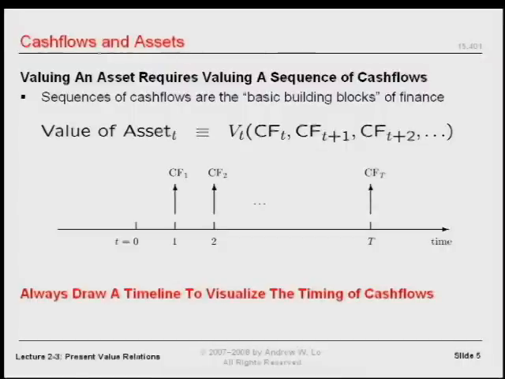

讲者要求，考试中做现值（present value）或估值计算，也要画出时间线。他说，估值错误常常来自没有把时间位置排列正确。这里要吸收的是操作习惯：**不要只抄金额，先对齐日期。**

学生还问，金融里的资产定义是否应与会计中的资产定义区分。Lo 的处理是，先抽象地研究实际现金流，再回到会计处理与实施细节。这个框架也可以用来考察会计惯例，但并不自动等同于账面记录。

### 5.3 先只保留时间，暂时去掉不确定性

金融分析的重要因素是时间和不确定性（uncertainty）。为了看清时间本身怎样影响价值，本课先排除随机性：现金流金额与是否支付，均提前确定。

这一步是简化模型，而非关于真实世界的断言。课中刚讨论的金融危机包含大量不确定性，但随后建立的估值公式，首先针对完全确定（perfect certainty）的情形。理解这一边界，才能在以后引入风险时知道哪些条件发生了变化。

## 6. 不同日期的钱，就像不同的货币

*视频定位：44:39—51:43。*

### 6.1 150 日元加 300 英镑，为什么不等于“450”

Lo 问：150 日元加 300 英镑，等于 450 什么？不能说是 450 美元，也不能只留下一个没有单位的 450。

这像把体重与年龄相加。数字可以进行算术运算，但结果没有清楚的解释。要比较或合并金额，必须先统一计量单位。

课中举例得到两个有效的合计结果：46,050 日元，或者约 300.98 英镑。这组结果隐含了算例所用的兑换关系：1 英镑对应 153 日元。

| 计价基准（numeraire） | 换算与相加 | 合计 |
| --- | --- | ---: |
| 日元 | 150 + 300 × 153 | 46,050 日元 |
| 英镑 | 300 + 150 ÷ 153 | 约 300.98 英镑 |

这只是课堂算例的兑换关系。两种结果描述同一组金额，差别在于选用了哪一个计价单位。

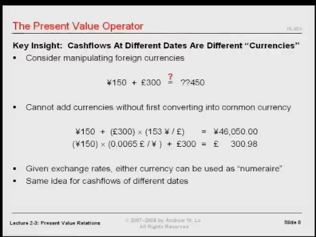

### 6.2 计价基准：选择统一的衡量单位

计价基准（numeraire）是用来衡量所有金额的记账单位。英国投资者可能希望使用英镑，日本投资者可能希望使用日元。只要换算一致，两种基准都可以。

Lo 要求大家把这种对单位的敏感性，应用到不同时点的钱：今天的美元与明天的美元，也不能直接相加。

把不同日期看成不同“货币”，并不是说它们换了国家或名称，而是强调它们提供消费和使用资金的时间不同。日期是金额的一部分。

### 6.3 用今天的美元作为统一基准

设今天为时点 0。如果未来有 T 个付款日期，就有 T 种需要换算回今天的日期货币。为避免跨期兑换率（exchange rate）的方向混淆，本文明确采用以下约定：

**dₜ = 未来时点 t 的 1 美元，可以兑换成多少时点 0 的美元。**

因此，未来现金流（cash flow） CFₜ 的今天价值是：

**PV₀(CFₜ) = CFₜ × dₜ。**

| 原来的现金流 | 对应的跨期兑换率 | 换算到今天的金额 |
| --- | --- | --- |
| 第 1 期的 CF₁ | d₁ | CF₁d₁ |
| 第 2 期的 CF₂ | d₂ | CF₂d₂ |
| 第 3 期的 CF₃ | d₃ | CF₃d₃ |
| … | … | … |
| 第 T 期的 CF_T | d_T | CF_Td_T |

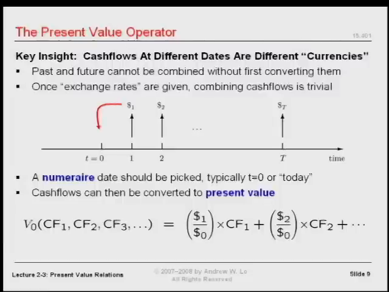

原字幕有一处口述把兑换方向说得不够清楚，因此译稿保留了疑点。上面的方向与课堂随后“未来现金流乘以贴现因子（discount factor）”的计算一致。使用任何兑换率时，都应先确认分子和分母对应的日期。

一旦每项都变成今天的美元，就可以相加。复杂的估值运算由此化为两个步骤：先统一单位，再求和。

## 7. 净现值：先换算，再扣除投入

*视频定位：51:48—01:01:10。*

### 7.1 “现”与“净”分别是什么意思

现值（present value）是把未来金额换算为今天货币后的价值。“现”说明选定的计价日期。

净现值（net present value，NPV）进一步计入初始投入。通常，项目在今天需要支付资金，未来才回收现金。因此，把今天的投入作为负现金流（cash flow） CF₀ 写进同一个式子，就得到：

**NPV = CF₀ + CF₁d₁ + CF₂d₂ + ⋯ + CF_Td_T。**

CF₀ 已经是今天的美元，无需再换算。若今天投入 I₀，则 CF₀ = −I₀。后续各期现金流也不一定全为正：后续支出同样必须在对应的时点写为负数。

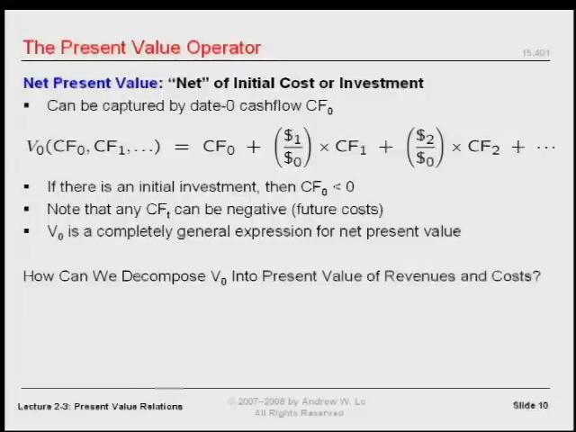

“净”的意思不是只保留收入，而是把收入与投入、支出一起计入。在尚未换算日期时，直接将各期金额求和，会犯下和直接相加日元与英镑同样的错误。

### 7.2 贴现因子从哪里来

这个框架仍然缺少一个输入：跨期兑换率（exchange rate）是谁给出的？Lo 的回答是市场。

他当堂模拟拍卖一张证券：承诺一年后支付 1 美元，今天有人愿意为它支付多少？竞价从低价逐步上升，最后停在 97 美分。

在这次课堂拍卖里，一年后的 1 美元对应今天的 0.97 美元，所以 d₁ = 0.97。对于五年后支付 1 美元的证券，也可以用类似过程得到五年期的兑换率。

金融市场的重要性正在这里：估值需要的输入，不必完全由分析者凭空编造，而可以从参与者的交易和价格中获得。

Lo 并没有在此证明市场提供的数值总是理想。他明确把“这样的市场机制是否可靠、是否有更好的市场”留给后续讨论。本课先建立一个条件结论：**给定合适的兑换率，就能为确定的现金流序列估值。**

### 7.3 没有违约风险，为什么还要贴现

学生提出一个关键问题：既然排除了不确定性（uncertainty），也就没有违约风险，那么未来的钱为什么仍然比今天的钱价值低？

Lo 首先从时间偏好（time preference）解释。人们通常更愿意现在消费，而不是等待。如果现在把钱交给别人，就放弃了这段时间内的消费机会，因此需要得到补偿。

在课堂的例子中，出借人今天交出 0.97 美元，一年后收到 1 美元。两者之间的差额，是让对方愿意等待的激励。另一位学生补充：今天的钱也可以借给其他现在需要资金的人，并收取使用资金的报酬。Lo 同意这个角度，并把更完整的利率（interest rate）形成机制留待后续展开。

通胀（inflation）是学生提出的另一个因素。但 Lo 区分了通胀与时间价值，并要求暂时把通胀放在一边，避免把两个概念混为一谈。他还承认，通缩与某些情况下的负实际利率可能发生。本课在这一点上没有展开通胀调整的公式。

因此，不能把“贴现只因为可能违约”或“贴现只因为通胀”作为本课的结论。即便在完全确定（perfect certainty）的设定下，放弃现在使用资金的机会，也能形成跨期价格差别。

## 8. 项目算例：1,000 万美元的投资是否值得做

*视频定位：01:01:10—01:06:29。*

### 8.1 先在时间线上摆好数字

市场给出两个贴现因子（discount factor）：

- 一年后的每 1 美元，值今天的 0.90 美元，即 d₁ = 0.90。
- 两年后的每 1 美元，值今天的 0.80 美元，即 d₂ = 0.80。

项目今天需要投入 1,000 万美元，第一年末回收 500 万美元，第二年末回收 700 万美元。

| 时点 | 现金流（cash flow） | 换算到今天的因子 | 今天的价值 |
| --- | ---: | ---: | ---: |
| 0：今天 | −1,000 万美元 | 1 | −1,000 万美元 |
| 1：一年后 | +500 万美元 | 0.90 | +450 万美元 |
| 2：两年后 | +700 万美元 | 0.80 | +560 万美元 |
| 合计 |  |  | **+10 万美元** |

计算为：

**NPV = −1,000 + 500 × 0.90 + 700 × 0.80 = 10 万美元。**

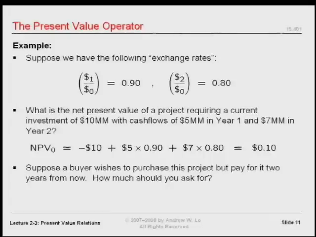

注意这里的单位：式中的 1,000、500 和 700 都以“万美元”为单位。计算结果的 10，也是 10 万美元。

未来回款的现值（present value）总额为 1,010 万美元，而计入 1,000 万美元初始投入后，净现值（net present value，NPV）是 10 万美元。把资产（asset）未来回款的现值，与项目在投入后的净现值区分开来，才能解释结果。

### 8.2 为什么估值会使管理决策变得简单

在课堂给定条件下，项目的净现值为正。Lo 把“该不该做这个项目”转化成“你想不想要以今天的美元计价的 10 万美元”。

他借此解释第一堂课的说法：困难的部分是估值；在现金流、时间和兑换关系都已经正确确定以后，选择可能变得简单。

这句话的前提很重要。它并不取消识别现金流、查找市场价格或核对模型假设的工作，而是说明这些工作怎样把一个复杂问题压缩成可以判断的数量。

### 8.3 买家两年后才付款，应该收多少钱

课堂接着提出：假设买家想购买这个项目，但两年以后才付款，应当开价多少？

Lo 先要求画时间线，确定付款是“一年后”还是“从今天算起的两年后”，再计算现值与未来值（future value）。金额的估值日期和实际收款日期必须分清楚。

按本课的兑换关系，如果某笔待交换价值在今天记为 P₀、在两年后付款记为 P₂，就必须满足：

**P₀ = 0.80 × P₂，因此 P₂ = P₀ ÷ 0.80。**

这说明怎样做日期换算；课堂口述没有完整展开交易所转移的权利与成本安排，因此不能脱离这些安排，把某个数字当作所有项目转让情境的统一价格。先确定交易对象对应的现金流，再确定付款日期，是这里需要掌握的方法。

### 8.4 这一计算依赖哪些假设

Lo 对当前框架归纳了三个条件：

| 条件 | 在计算中承担的作用 |
| --- | --- |
| 现金流提前确定已知 | 不需要处理支付金额或是否支付的随机性 |
| 跨期兑换率（exchange rate）已知，或能从市场获得 | 可以把不同日期的金额换算到统一基准 |
| 兑换没有摩擦（friction） | 暂不计手续费等交易成本 |

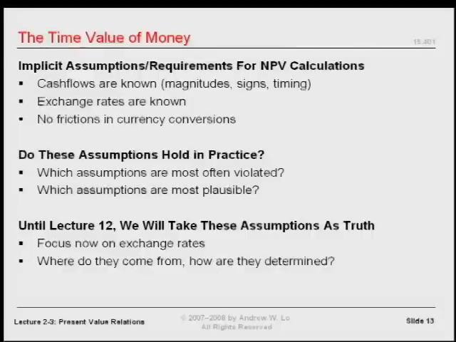

最后一项容易被忽略。现实中出国换汇往往要付手续费，现金流在时间上的转换也可能存在成本。本课暂时忽略这些摩擦，以便先理解模型怎样运作。

这三项是近似和假设。课程的路线是先理解简化条件下的结论，再逐步质疑、扩展和修正条件。前面为理解时间价值暂时排除的随机性，也会在后续估值讨论中重新引入。

## 9. 用利率 r 统一跨期兑换关系

*视频定位：01:06:29—01:13:16。*

### 9.1 从兑换率的倒数走向未来值

贴现因子（discount factor）把未来的钱换成今天的钱。反方向，把今天的钱换成一年后的等价金额，就用它的倒数。

Lo 将这个一年期增长因子写作 1 + r。通常以正的 r 为讲解对象时，增长因子大于 1，贴现因子小于 1：

**一年期增长因子 = 1 + r；一年期贴现因子 = 1 / (1 + r)。**

注意，r 本身并不是贴现因子。r 是利率（interest rate），贴现因子是由它算出的另一个数。

对于前面的 0.97 例子，按定义换算可得 r = 1 / 0.97 − 1，约为 3.09%。课堂所说的“3% 折扣”是相对未来 1 美元的价格折扣，两种百分比的分母不同。

### 9.2 相同年利率连续应用

如果假设每年使用同一个 r，一年增长乘以 1 + r，两年就连续乘两次，得到 (1 + r)²，T 年则是 (1 + r)T。

| 从今天开始持有 | 未来的等价金额 |
| --- | --- |
| 1 年 | PV₀ × (1 + r) |
| 2 年 | PV₀ × (1 + r)² |
| T 年 | PV₀ × (1 + r)T |

因此：

**FV_T = PV₀ × (1 + r)T。**

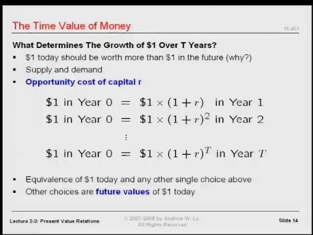

Lo 也说，可以直接用一个覆盖两年的增长率，但他更愿意以“年”为单位组织记号。统一时间单位以后，幂次就清楚地对应经过的年数。

### 9.3 资本机会成本与市场输入

r 在课堂里有几个名称：利率、增长率、资本成本（cost of capital）、资本机会成本（opportunity cost of capital）。Lo 还提到了凯恩斯使用的“使用成本”一词。这里，多个名字围绕的是把资金在时间上前后转换所需要的那个率。

资本机会成本（opportunity cost of capital）的视角，将资金的当前使用机会与跨期补偿联系起来。具体的数值仍然来自市场，而不是因为写下一个字母就自动得到了它。

Lo 紧接着提醒：真实市场会给出很多不同的 r。本课先假设只有一个 r，是为了建立统一的计算记号。

因此，前面给定 d₁ = 0.90、d₂ = 0.80 的算例，应直接使用这两个因子。不能因为后面讨论了单一 r 的模型，就擅自把 0.80 改成 0.90² = 0.81。**一组已给定的期限兑换率（exchange rate），与一个恒定利率假设，是不同的输入条件。**

### 9.4 从未来换回今天，要除以增长因子

反向换算时，未来第 t 年的一笔 CFₜ，对应的今天价值为：

**PV₀(CFₜ) = CFₜ / (1 + r)t。**

所以，在同一 r 的假设下：

| 现金流（cash flow）所在日期 | 换回今天的贴现因子 |
| --- | --- |
| 一年后 | d₁ = 1 / (1 + r) |
| 两年后 | d₂ = 1 / (1 + r)² |
| t 年后 | dₜ = 1 / (1 + r)t |

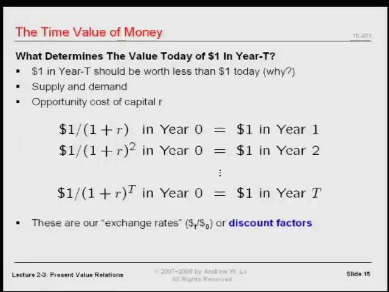

这里的平方作用在整个 1 + r 上：1 / (1 + r)²，不能写成 1 / (1 + r²)。无论向前增长还是向后贴现，都要先确认跨越了多少个时期。

## 10. 组合起来：现值公式、自测与下一课

*视频定位：01:13:21—01:15:50。*

### 10.1 一个条件明确的估值算子

将前面的净现值（net present value，NPV）表达式与恒定 r 的贴现因子（discount factor）放在一起，得到本课最终的估值方法：

**NPV = CF₀ + CF₁ / (1 + r) + CF₂ / (1 + r)² + ⋯ + CF_T / (1 + r)T。**

也可以写成：

**NPV = Σ（t 从 0 到 T）CFₜ / (1 + r)t。**

当 t = 0 时，分母等于 1，初始现金流（cash flow）自然保留在式中。

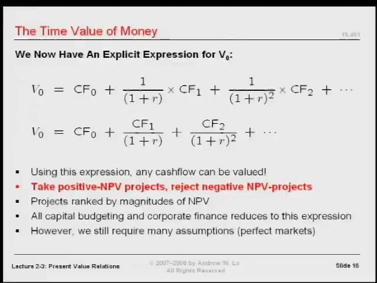

Lo 的结论有明确边界：在现金流完全确定（perfect certainty）、采用所讨论的市场兑换关系和简化假设时，任何现金流序列都可以用这个算子估值。由于资产（asset）已经被定义为现金流序列，这就给出了一个适用于多种资产形式的共同估值框架。

### 10.2 练习一：今天 100 美元，三年后是多少

课堂要求自行检验：今天有 100 美元，年利率（interest rate） r = 7%，三年以后值多少？

先画时间线。钱从时点 0 移到时点 3，所以按同一个年利率连续增长三年。

**FV₃ = 100 × 1.07³ ≈ 122.50 美元。**

这个数值是按课堂给出的公式在编排时补算的验算结果。关键并不是记住答案，而是认清“向未来移”和“三个时期”。

### 10.3 练习二：三年后的 180 美元，在一年后值多少

另一道自测题：三年后有 180 美元，r = 8%，要求的价值日期不是今天，而是一年后。

| 时间位置 | 第 1 年 | 第 2 年 | 第 3 年 |
| --- | --- | --- | --- |
| 作用 | 要求价值的基准时点 | 中间时期 | 180 美元实际到账 |

从第 3 年换回第 1 年，跨越的是两年，因此：

**V₁ = 180 / 1.08² ≈ 154.32 美元。**

这同样是编排时的公式验算。若除以 1.08³，得到的是今天的价值，而不是题目要求的一年后价值。这正说明为什么必须先画时间线。

### 10.4 一次估值的操作顺序

把本课反复强调的方法整理成一个计算顺序：

1. 确定估值日期，以及实际的收付款日期。
2. 列出现金流序列，收入为正，支出为负。
3. 画时间线，核对每个金额对应的时期。
4. 选定统一的计价基准（numeraire），例如今天的美元。
5. 使用给定的贴现因子；若模型给定恒定 r，则由 r 算出相应因子。
6. 将各期现金流换算到该基准，再求和，并计入初始投入。
7. 解释这个数是回款现值（present value）、净现值，还是某个未来日期的等价金额，检查模型假设是否适用。

下一课将把这个框架用于年金（annuity）和永续年金（perpetuity），并进一步联系按揭贷款的月供计算。本课完成的是它们的基础：知道估值输入是什么，为什么日期必须保留，以及如何把不同日期的金额换成可以比较、相加的价值。

---

原课程由 Andrew W. Lo 讲授，MIT OpenCourseWare 提供；原视频字幕注明采用知识共享许可。中文翻译与章节编排依据本视频，公式验算已明确标出。少量学生发言在原字幕中不可辨；跨期兑换方向与通胀（inflation）比较的口述疑点保留在逐段译稿和对应核对记录中。
