# MIT 金融理论 I · 第 3 讲：现值关系 II

> **Andrew W. Lo · MIT 15.401 Finance Theory I · 2008 年秋季**  
> 本讲从净现值决策出发，推导永续年金、增长型永续年金和有限期年金，最后讨论复利及利率报价。正文依据完整课堂字幕整理，插图直接由 MIT 官方原始 PDF 渲染。时间链接用于定位对应讲解；图片保留课件原貌。

[返回主页](https://foolishdominator.github.io/) · [课程笔记](https://foolishdominator.github.io/lessons/) · [完整视频](https://www.youtube.com/watch?v=4F1J5Q3DiaI) · [原始课件 PDF](https://ocw.mit.edu/courses/15-401-finance-theory-i-fall-2008/73c95059e657c8a7acb042ea33a21940_MIT15_401F08_lec02.pdf)

[TOC]

## 1. 课前问答：汇率、证券与金融危机

**讲解区间：[00:21–21:12](https://www.youtube.com/watch?v=4F1J5Q3DiaI&t=21s)**

### 1.1 “确定”与“恒定”是两个不同的假设

学生首先问：某个项目的净现值（net present value，NPV），能否以一种货币计算时为正，换成另一种货币时为负？

如果汇率（exchange rate）在所有日期都等于同一个正数 S，那么每笔现金流（cash flow）都乘以相同系数。在贴现关系也保持一致的情况下，可以把 S 提出求和符号：

另一币种的 NPV = S × 原币种的 NPV，S &gt; 0。

此时，正负号不会因为统一换算而改变。但课堂随即指出：**没有不确定性（uncertainty），不等于某个量随时间保持不变。** 一条未来完全已知的汇率路径，也可能逐年上升或下降。

若不同日期使用不同的汇率，就不能从所有现金流中提出同一个常数。必须先确定自己关心的收付款币种，再处理各期的货币换算与相应的贴现。等引入不确定性以后，汇率还会成为额外的风险来源。

**编者说明：**讲师这一段的部分口述同时使用了“fixed”和“随时间上升”，措辞并不严密，而且尚未建立不同币种贴现率之间的关系。因此，不能仅凭这段讨论断言“改变计价单位就能改变项目经济价值”。这里应掌握的是：区分已知与恒定，明确计价币种，并一致地处理汇率和贴现。

### 1.2 金融语境中的 paper 是什么

在金融讨论中，paper 常用来指证券（security）。商业票据（commercial paper）是一种债务工具（debt instrument），本质上代表发行人的付款承诺，类似一张欠条（IOU）。这与拥有公司部分所有权的股票是不同的权利。

讲师同时提醒，课堂只有有限的时间，不能逐一解释所有金融术语。指定教材 Brealey、Myers 与 Allen 的相关章节，需要与课堂同步阅读；课堂没有定义过的术语，仍可能是必须掌握的知识。

### 1.3 公司股价下跌，为什么整个市场反而上涨

课堂以当时的房利美（Fannie Mae）与房地美（Freddie Mac）救助为例，区分两组利益：

| 权利或影响 | 救助讨论中的含义 |
| --- | --- |
| 所有者权益（owner's equity） | 公司亏损会损害原有股东的投资；救助并不意味着股东的损失得到补偿 |
| 已发行的债务证券 | 政府承担或支持付款义务，能降低这些证券无法偿付的担忧 |
| 对其他企业的影响 | 持有相关债权、与相关机构交易的企业，以及更广泛的经营环境，都可能受影响 |

因此，“被救助公司的原股东受损”与“整个股市受到提振”可以同时发生。其他企业即使没有直接持有相关债务，也可能因为经营环境更稳定而受益。

讲师用雷曼兄弟（Lehman Brothers）说明连锁传导：一个大型金融机构承压，可能冲击交易对手（counter-parties），再传导到其他机构及整个市场。这是 **2008 年课堂当时的讨论**，其中关于未来几天走势或机构是否倒闭的发言，应按当时的信息环境理解。

### 1.4 救助的两难与工具的适用范围

救助面临两方面的权衡：一方面，频繁救助可能产生道德风险（moral hazard），使投资者形成“损失由别人承担”的预期；另一方面，任由机构倒闭，也可能引发大规模恐慌和严重经济衰退。

讲师用森林火灾作比喻：受控燃烧可以形成防火带，阻止火势蔓延。但金融系统没有一架能看清所有火源的“直升机”；隐藏的债务、交易关系和潜在损失，使隔离风险更加困难。他的个人看法是，市场可能还需要经历损失，才能重新认识风险，同时也必须防止失控的恐慌。

对于高管被解雇后仍获得丰厚补偿的问题，讲师没有立即给出政策结论，而是指出金色降落伞（golden parachutes）、薪酬和绩效之间存在激励关系，将在公司金融（corporate finance）部分讨论。

学生还提出国际救助政策的差异。讲师给出的思考方法是：先分别辨认经济问题、政治问题和社会问题，再讨论如何权衡。经济学能分析激励与成本，但并不能独自决定全部政治和社会取舍。

## 2. 从现金流序列到净现值决策

**讲解区间：[21:16–25:13](https://www.youtube.com/watch?v=4F1J5Q3DiaI&t=1276s)**

### 2.1 资产与资产价值

资产（asset）是一系列现金流（cash flows），而资产的价值是把这组现金流输入价值函数后，得到的一个数。把两者区分开，是本讲所有公式的起点。

以每期贴现率（discount rate）恒定为 r 的简化情况为例，今天的价值为：

V0 = CF0 + CF1 / (1+r) + CF2 / (1+r)2 + …

CF₀ 可以是负数，例如初始投资；未来各期的现金流也可以是负数，例如后续成本。把这些成本一并纳入，就得到净现值（net present value，NPV）。

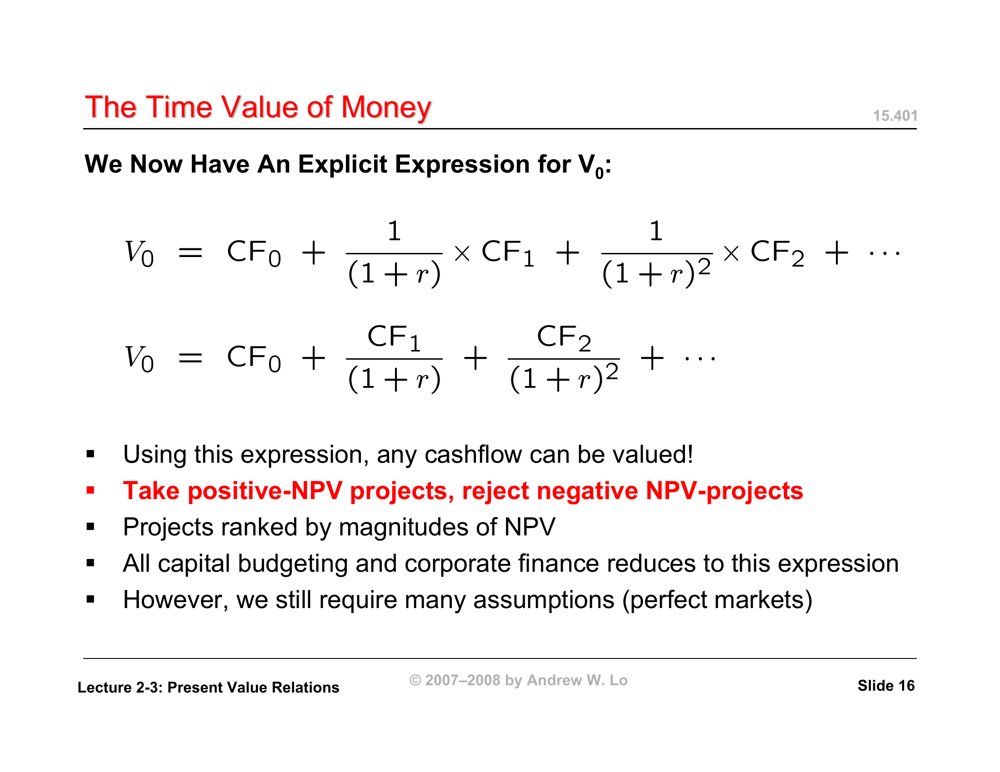

在本讲的简化框架中，决策规则是：**接受净现值为正的项目，拒绝净现值为负的项目。** 后续课程的任务，是逐步放宽假设，让现金流预测、贴现率和市场条件更加贴近现实。

### 2.2 今天与未来之间的“兑换率”

货币时间价值（time value of money）允许把不同日期的金额转换到同一日期。若 r=5%，今天的一美元对应：

| 日期 | 今天 1 美元的未来金额 |
| --- | ---: |
| 一年后 | 1.05 美元 |
| 两年后 | 1.1025 美元，课件约写为 1.103 |
| 三年后 | 1.157625 美元，课件约写为 1.158 |

反过来，t 年后的一美元，其现值（present value，PV）为：

PV = 1 / (1+r)t。

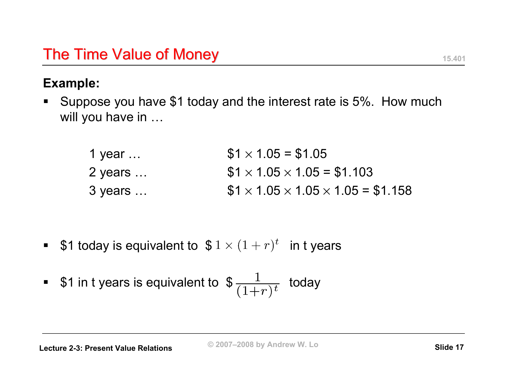

在正利率假设下，收到现金的时间越远，现值越低；对于同一个未来日期，贴现率越高，现值也越低。下图用 4%、8% 与 12% 三条曲线展示这种关系。

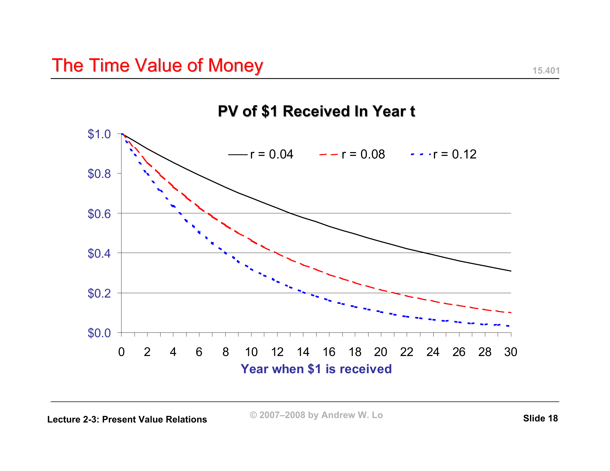

## 3. 投资例题：照明系统与利息补贴

**讲解区间：[25:18–29:41](https://www.youtube.com/watch?v=4F1J5Q3DiaI&t=1518s)**

### 3.1 节省成本也构成现金流

一家公司的总部每年支付 80 万美元电费。安装计算机控制的照明系统，需要立即投入 23 万美元，并在之后三年每年节约 9 万美元。

估值（valuation）时，应该关注因采用该方案而发生变化的现金流（cash flows）。原有 80 万美元电费是背景；本题的投资序列是：

| 期数 | 0 | 1 | 2 | 3 |
| --- | ---: | ---: | ---: | ---: |
| 增量现金流，美元 | −230,000 | 90,000 | 90,000 | 90,000 |

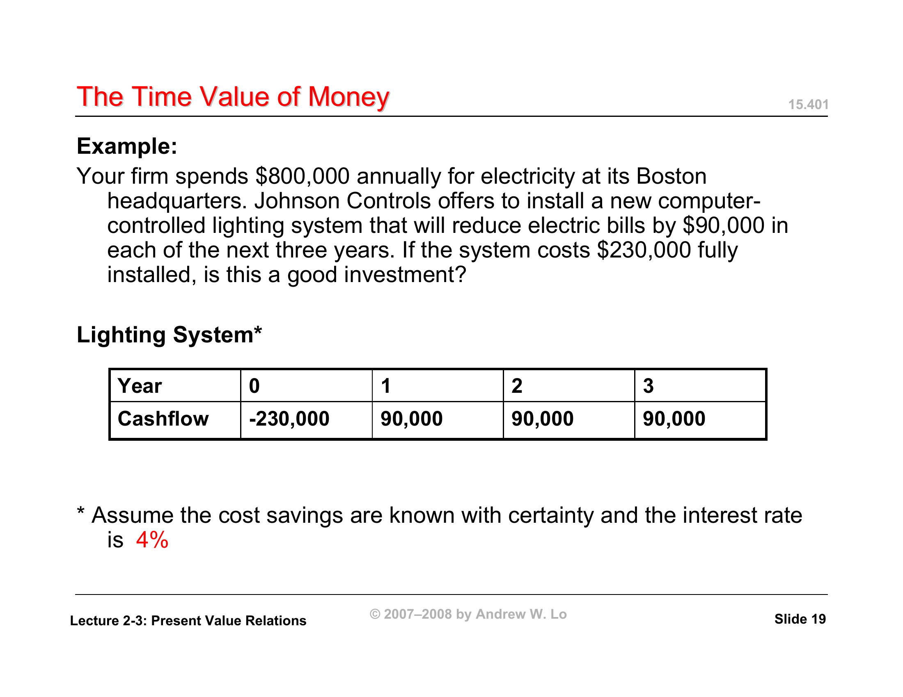

假设节约额确定，贴现率（discount rate）为 4%，净现值（net present value，NPV）就是：

NPV = −230,000 + 90,000/1.04 + 90,000/1.042 + 90,000/1.043 = 19,758.19 美元。

课件将结果约写为 19,758 美元；讲师口述为约 2 万美元。在这些假设下，项目值得接受。

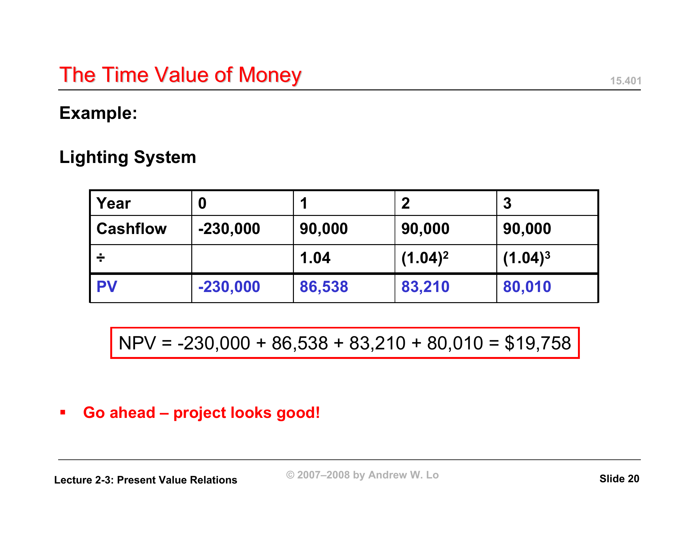

### 3.2 利率改变，决策也可能改变

如果市场利率更高，现在的资金就有更高的机会成本（opportunity cost）。把钱用于照明系统，意味着放弃了其他可获得的收益，因而未来节约额的现值会下降。

例如，沿用本题的现金流，仅把 r 改为课堂讨论的 10%，复算得到 NPV 约为 **−6,183.32 美元**，项目便不再有正净现值。

利率来自市场中实际可获得的投资机会，不能由管理者凭感觉挑选。管理者需要先识别可行替代方案，再进行估值与权衡。正确估值能帮助决策，但获得可靠的现金流与利率输入本身仍是一项重要工作。

### 3.3 课件自练：优惠贷款值多少钱

讲师简要介绍中海油（CNOOC）收购优尼科（Unocal）的课件例子，让学生自行做粗略计算。课件中的报价为每股 67 美元，并假设母公司提供合计 70 亿美元的优惠贷款。普通借款利率为 8%，优惠融资条件如下：

| 贷款 | 本金 | 优惠利率 | 期限 | 每年节省的利息 |
| --- | ---: | ---: | ---: | ---: |
| 贷款 1 | 25 亿美元 | 0% | 2 年 | 25 亿 × 8% = 2 亿美元 |
| 贷款 2 | 45 亿美元 | 3.5% | 30 年 | 45 亿 × (8%−3.5%) = 2.025 亿美元 |

要估算利息补贴（interest subsidy）的现值（present value），先写出每年的利息节约，再按普通融资利率贴现。按课件的年末付款序列，前两年同时获得两笔贷款的节约，之后只剩第二笔。

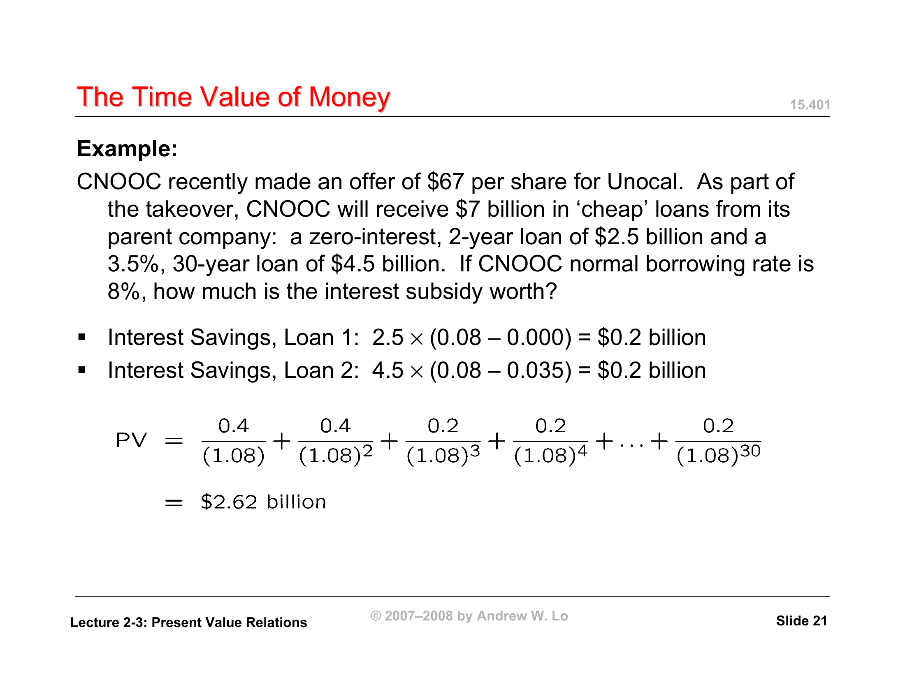

**课件数字核对：**原图把两笔年度节约都近似写为 2 亿美元，并给出约 26.2 亿美元的答案。按图中明确列出的“前两年 4 亿、随后 28 年每年 2 亿”序列，以 8% 复算为 **26.0821 亿美元**；若保留第二笔贷款每年 2.025 亿的精确值，则为 **26.3635 亿美元**。原图的近似答案与展示的数值存在小幅差异，这里保留原图并明确说明。该例的重点是，把融资优惠转换为现金流，再计算现值。

## 4. 永续年金：无限期付款为什么有有限价值

**讲解区间：[29:45–45:38](https://www.youtube.com/watch?v=4F1J5Q3DiaI&t=1785s)**

### 4.1 定义与付款时点

永续年金（perpetuity）是一项从下一期开始、每期永远支付相同金额 C 的权利。今天是第 0 期，付款发生在第 1、2、3……期。

假设每期利率（interest rate）恒定为 r，且 r&gt;0，则其现值（present value，PV）为：

PV = C/(1+r) + C/(1+r)2 + C/(1+r)3 + …

付款的名义金额加总是无穷大，但越远期的现金流（cash flow），贴现到今天的价值越小。只要这个贴现后的级数收敛，现值就可以有限。

### 4.2 乘、减、除的推导

把等式两边乘以 1+r，会得到原级数再加一个 C：

(1+r)PV = C + PV rPV = C <strong>PV = C/r</strong>

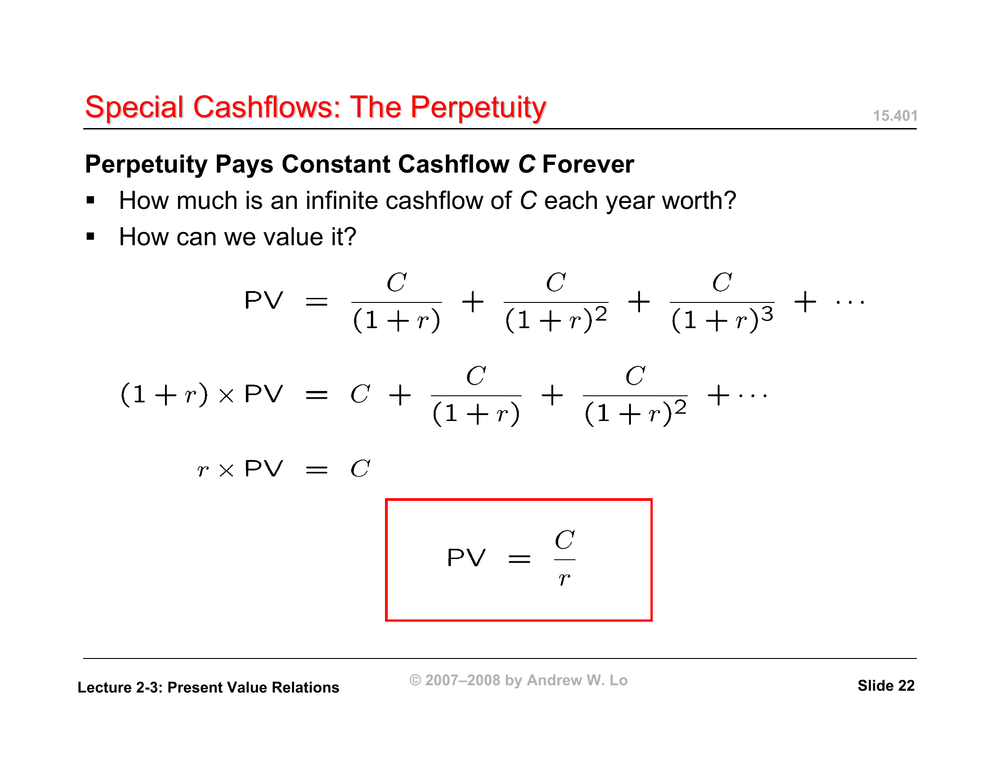

假设永远每年支付 100 美元：

| 每年利率 r | 现值 C/r |
| --- | ---: |
| 10% | 100/0.10 = 1000 美元 |
| 5% | 100/0.05 = 2000 美元 |

这个公式依赖固定现金流、恒定贴现率，以及第一笔付款在下一期等条件。若利率随时间变化，就要回到逐期贴现的方法，不能继续直接使用一个固定的 C/r。

### 4.3 真实交易与市场利率

讲师以英国永续公债（consol）作为课堂中的历史例子，也提到迪士尼（Walt Disney）曾发行百年期债券。百年与永远并不相同，但在适当的正贴现率下，遥远未来的付款对现值的贡献已经很小，因此很长的付款序列可以接近永续情形。

对一项符合永续年金假设的权利，市场价格 P 与利率之间可以相互换算：

P = C/r，因而 r = C/P。

例如 C=100 美元、市场价格 P=500 美元，隐含利率就是 20%。价格不是凭空给定的，它反映了市场参与者对未来、风险与替代机会的判断。

### 4.4 拍卖怎样形成价格

市场定价（market pricing）并非没有分析。研究者提供估值方法，交易者再结合经营因素作出报价。这个过程可能犯错，但讲师认为市场机制总体仍有重要的信息功能。

拍卖（auction）的设计会影响报价是否能够反映真实经济估值。课堂举出一种机制：最高报价者获胜，但支付第二高报价，而非自己的最高报价。讲师用它说明，规则可以改变参与者的激励，使报价更接近真实偏好。

课程此时先假设市场能够提供合适价格；后面再研究市场机制、激励，以及心理偏差（psychological biases）为什么会使这个假设受到挑战。不同年份的价格也不能脱离当时的信息比较，因为市场条件会变化。

### 4.5 价格没涨，并不意味着没有收益

如果 C 和 r 都不变，永续年金的价格 C/r 就不变。以 C=100、r=10% 为例，今天价值 1000 美元，未来同一付款时点下仍然价值 1000 美元。

但持有人每年收到 100 美元票息（coupon）。因此，价格收益率（price return）为零，并不代表总收益率（rate of return）为零。按同一期初与期末的价格口径：

一年的总收益率 = (期末价格 − 期初价格 + 当年付款) / 期初价格 = (1000 − 1000 + 100) / 1000 = 10%。

## 5. 增长型永续年金：为什么必须 r&gt;g

**讲解区间：[45:42–52:26](https://www.youtube.com/watch?v=4F1J5Q3DiaI&t=2742s)**

### 5.1 C 表示下一期的第一笔付款

在增长型永续年金（growing perpetuity）中，现金流（cash flow）永远持续，但每期按恒定增长率（rate of growth）g 增长。这里的 C 是下一期的付款，不是今天的付款：

| 期数 | 1 | 2 | 3 | … |
| --- | --- | --- | --- | --- |
| 付款 | C | C(1+g) | C(1+g)² | … |

若 C=100 美元、g=5%，前三笔依次为 100、105、110.25 美元。

按恒定贴现率（discount rate）r 贴现，得到：

PV = C/(1+r) + C(1+g)/(1+r)2 + C(1+g)2/(1+r)3 + … <strong>PV = C/(r−g)，条件是 r &gt; g。</strong>

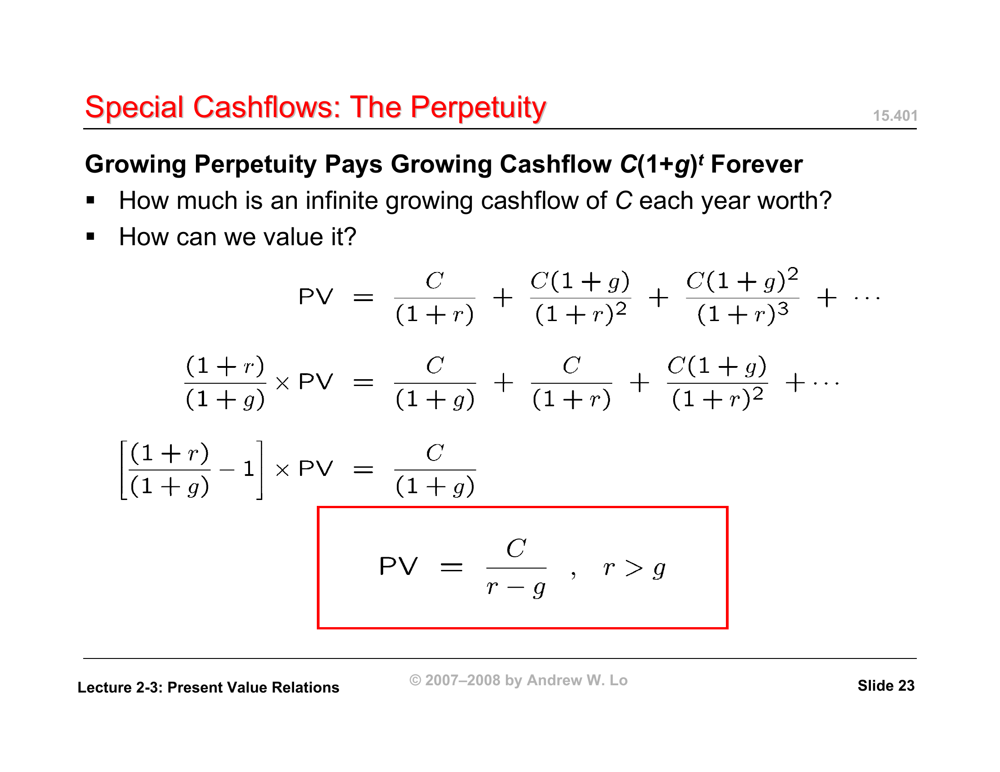

相对于同样第一笔付款的固定永续年金（perpetuity），在其他条件相同、正增长且满足 r&gt;g 时，分母变小，现值（present value）变大。这是未来付款增长的结果。

### 5.2 r=g 时，每项贴现值不再变小

若 r=g，增长恰好抵消贴现。每一项都变成相同的正数：

C(1+g)t−1 / (1+r)t = C/(1+r)。

把无穷多个相同的正数相加，结果会发散。因此，不能把 r=g 直接代入一个分母为零的简式，假装得到普通的有限价格。

若 g&gt;r，付款增长得比贴现衰减更快，原级数同样不收敛。**C/(r−g) 的适用条件已经不成立，不能因为分母为负，就把一串正付款解释成负价值。**

### 5.3 短期高增长与永远高增长

讲师强调，有限时期内增长率超过利率，并没有被这个结论排除。限制来自“永远保持同样增长率”的假设。

课堂以当时中国的高速经济增长作说明，并用夸张的星球比喻强调：把某一时期的高增长无限外推，会得到不合理的长期结果。应区分短期增长观察与无限期模型假设。这个公式以后会用于债券与股票定价。

## 6. 有限期年金：两项永续年金的差

**讲解区间：[52:30–64:47](https://www.youtube.com/watch?v=4F1J5Q3DiaI&t=3150s)**

### 6.1 从逐期贴现得到年金公式

年金（annuity）在有限的 T 期内，每期支付固定金额 C，然后停止。这里讨论第一笔付款在下一期、共 T 笔的普通付款序列。

其现值（present value，PV）为：

PV = C/(1+r) + C/(1+r)2 + … + C/(1+r)T <strong>PV = (C/r) × [1 − 1/(1+r)T]</strong>

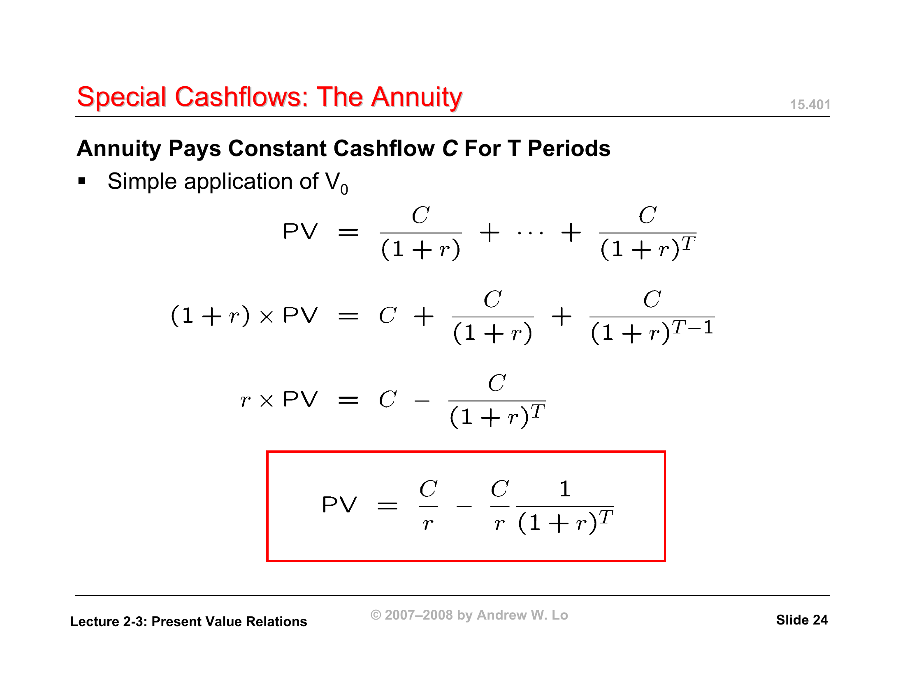

课堂提到汽车贷款、房贷和债券等应用。学生问本金（principal）是在每次付款中归还，还是到期才归还；讲师把这个问题留到债券部分。因此，此处应先掌握付款序列的估值，具体工具还需要核对本金与利息如何安排。

### 6.2 用现金流相减理解，而非只记公式

从第 1 期开始付款的永续年金（perpetuity），减去从第 T+1 期开始付款的永续年金，剩下的就是第 1 至 T 期付款的年金。

| 现金流序列 | 第 1 期 | … | 第 T 期 | 第 T+1 期 | 第 T+2 期及以后 |
| --- | ---: | --- | ---: | ---: | --- |
| 完整永续年金 | C | … | C | C | C，C，… |
| 减去的远期永续年金 | 0 | … | 0 | C | C，C，… |
| 剩余有限期年金 | C | … | C | 0 | 0，0，… |

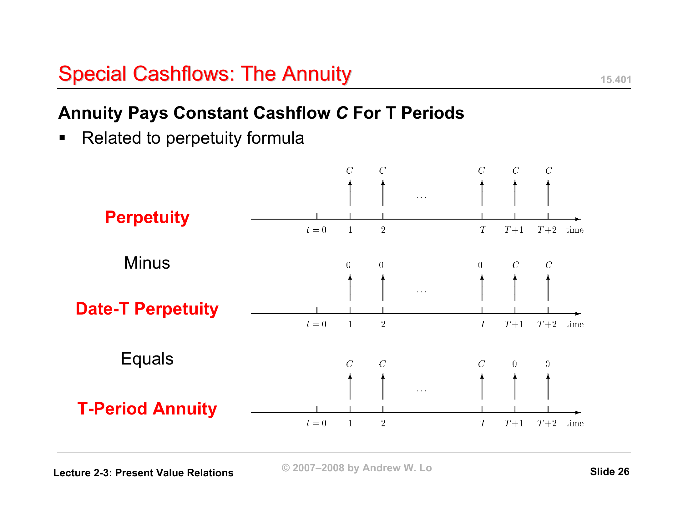

完整永续年金在第 0 期的价值为 C/r。需要减去的那项永续年金，其第一笔付款在 T+1，因此它在 **T 时点** 的价值为 C/r。将这个价值折算回第 0 期，要贴现 **T 期**：

被减去部分在第 0 期的价值 = (C/r) / (1+r)T 前 T 笔付款的价值 = C/r − (C/r)/(1+r)T。

### 6.3 T 与 T+1 的课堂澄清

这段讲解一度容易混淆。讲师最初把出售时间、现金流开始时间和估值时间混在一起，口称贴现 T+1 期；在 [60:37](https://www.youtube.com/watch?v=4F1J5Q3DiaI&t=3637s) 开始纠正，并在 [63:08](https://www.youtube.com/watch?v=4F1J5Q3DiaI&t=3788s) 的黑板说明中明确：

**第一笔剩余付款在 T+1，而这串剩余付款的 C/r 价值是在 T。因此，贴现指数是 T。**

也可以理解为：在第 0 期买入永续年金，领取第 1 至 T 期付款，在第 T 期刚收到第 T 笔付款后，出售剩余付款权利。原语言订正稿与逐段译稿保留课堂的纠正过程；这里按照最终澄清组织推导。

画时间轴时，始终分别标清“哪期付钱”和“在哪个时点估值”，就能避免把 T 与 T+1 混为一谈。

## 7. 年金贴现因子与房贷付款额

**讲解区间：[64:51–68:46](https://www.youtube.com/watch?v=4F1J5Q3DiaI&t=3891s)**

### 7.1 把现金流金额与利率部分分开

年金贴现因子（annuity discount factor，ADF）将每期付款额 C 与时间、利率条件分开：

ADF(r,T) = [1 − (1+r)−T] / r PV = C × ADF(r,T)。

已知贷款本金对应的现值（present value）PV、每期利率（interest rate）r 以及付款期数 T，就可以求每期固定付款：

<strong>C = PV / ADF(r,T)</strong>。

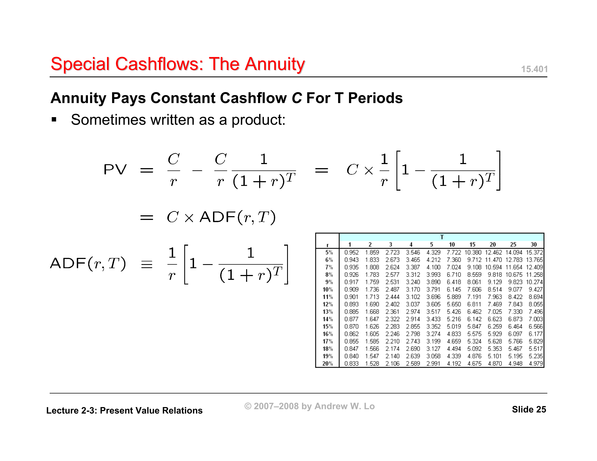

讲师以借款 20 万美元买房为说明：贷款金额在等式左边，每月付款在右边，合适的每期利率进入 ADF。月度现金流必须使用月度利率和总月数，计算时要明确利率报价采用什么口径；下一节解释为何不能混用年百分比利率与有效年利率。

反过来，已知每期付款、期数与利率，也能算出贷款的市场价值。

### 7.2 查表与计算的底层方法相同

讲师回忆自己首次办理房贷：银行的表册没有当日那个利率，他用公式自己算出月供。工作人员逐级询问、最终从总行查到的数字，与他的结果一致到小数点后第四位。

这个故事说明，表册、计算器或 Excel 只是计算手段，背后的依据仍然是年金公式。同一张年金贴现因子表可以适用于房贷、汽车贷款与其他具有相同付款结构的消费信贷。

### 7.3 课件自练：中了彩票，是不是百万富翁

课件给出每年领取 10 万美元的彩票，分别比较 20 年、50 年与永久支付，假设 r=10%。这些数值题由讲师留给学生自行阅读。

| 支付期限 | 现值计算 | 现值，美元 |
| --- | --- | ---: |
| 20 年 | 100,000/0.10 × (1−1.10⁻²⁰) | 851,356.37 |
| 50 年 | 100,000/0.10 × (1−1.10⁻⁵⁰) | 991,481.45 |
| 永久 | 100,000/0.10 | 1,000,000.00 |

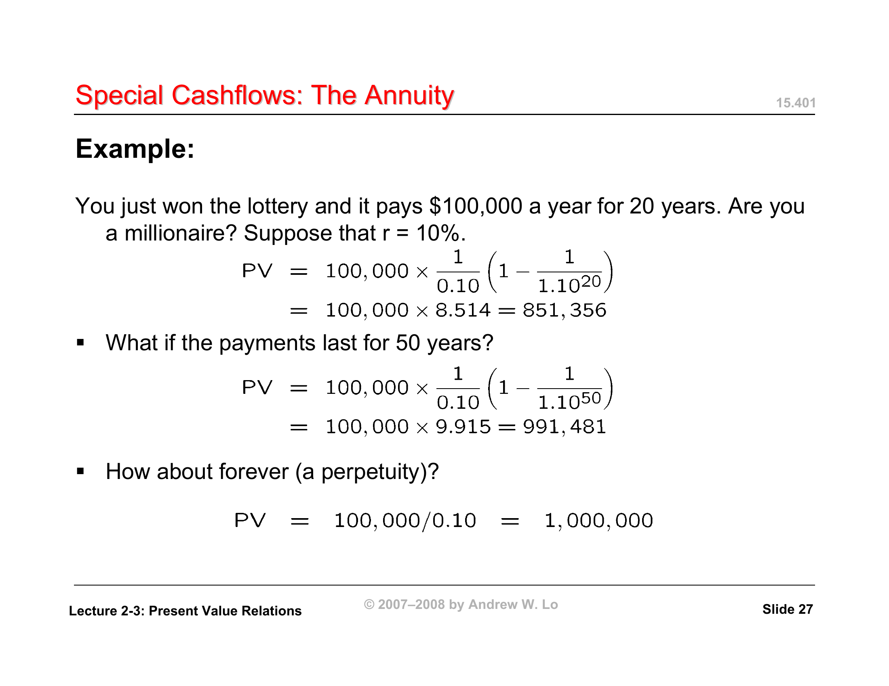

20 年名义付款总额为 200 万美元，但这不是今天的价值。期限越长，现值越接近永续年金的 100 万美元；远期新增付款的现值贡献则越来越小。

## 8. 复利：APR 与 EAR 为什么不同

**讲解区间：[68:52–78:57](https://www.youtube.com/watch?v=4F1J5Q3DiaI&t=4132s)**

### 8.1 六个月取款，引出了什么问题

利率通常以年化口径报价，但资金可能只持有半年或一个月。复利（compounding）讨论的是：中途产生的利息是否加入本金，再继续产生利息。

若年百分比利率（annual percentage rate，APR）为 10%，约定半年支付 5%，则：

| 时点 | 本金与已累积利息 |
| --- | ---: |
| 年初 | 1000 美元 |
| 半年后 | 1000 × 1.05 = 1050 美元 |
| 年末，再存半年 | 1050 × 1.05 = 1102.50 美元 |

第二个半年不只在原始本金上取得收益，还在前半年的利息上取得收益。所以全年实际收益为 10.25%，超过报价中的 10%。

### 8.2 如果全年收益必须恰好为 10%

另一种约定是，规定全年有效收益恰好为 10%，再求对应的半年利率 i：

(1+i)2 = 1.10 i = √1.10 − 1 ≈ 4.8809%。

这个半年利率略低于 5%。讲师借此说明，直接除以计息次数与根据全年有效收益反推每期收益，是两种不同的报价处理方式。

### 8.3 一般公式

若报价 APR 为 r，每年复利 n 次，每期利率为 r/n，则一年的本金增长倍数为 (1+r/n)ⁿ。因此，有效年利率（effective annual rate，EAR）为：

<strong>EAR = (1+r/n)n − 1</strong>。

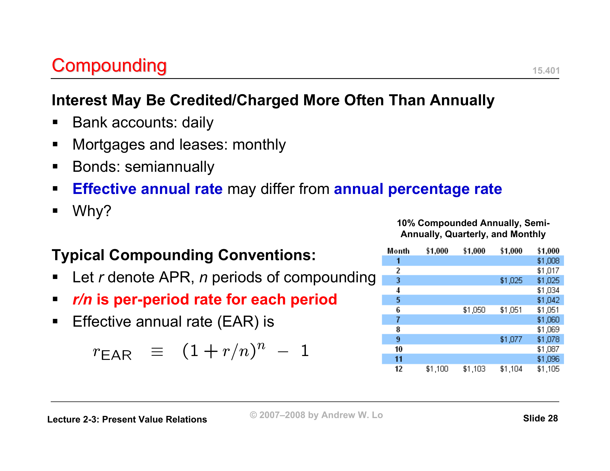

讲师口述中也使用 equivalent annual rate，译稿保留了这个措辞；课件采用 effective annual rate，正文统一译为有效年利率。学生另外提到年百分比收益率（annual percentage yield，APY），课堂没有展开其细节。

对 APR=10%、本金为 1000 美元的情况，按公式复算：

| 每年复利次数 | 每期利率 | EAR | 年末金额，美元 |
| --- | --- | ---: | ---: |
| 1 次 | 10% | 10.0000% | 1100.00 |
| 2 次，半年 | 5% | 10.2500% | 1102.50 |
| 4 次，季度 | 2.5% | 10.3813% | 1103.81 |
| 12 次，月份 | 10%/12 | 10.4713% | 1104.71 |
| 365 次，每日 | 10%/365 | 10.5156% | 1105.16 |

课堂把前三种额外收益粗略说成约 3、4、5 美元，正文表格保留到美分。在同样 APR 下，提高复利频率会提高有效年利率。作为借款人，真正承担的金额也会受到这种复利效应影响。

### 8.4 课件自练：6.75% 的汽车贷款

原课件另有一个按日复利的例子：借入 10,000 美元，APR 为 6.75%，对未偿还余额按日计息。假设期间不还款、每年取 365 天，则：

一年后的余额 = 10,000 × (1+0.0675/365)365 ≈ 10,698.24 美元 EAR ≈ 6.9824%。

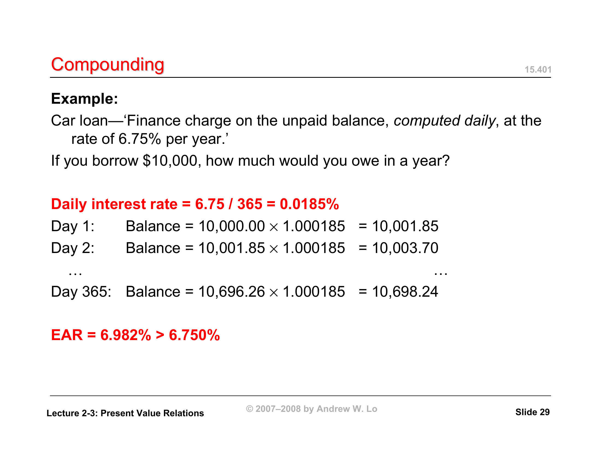

课件把日利率显示为约 0.0185%，但其最终金额对应的是使用未提前取整的 0.0675/365 计算。中间展示值可以取近似，计算过程中应保留足够精度。

### 8.5 读报价时，要同时确认复利约定

只知道 APR，还不足以确定全年金额；必须知道复利频率。银行账户可能按日计息，抵押贷款与租约可能按月，债券可能按半年；这些都是课件中用于说明不同惯例的例子。

讲师以随时取款的账户说明，按日计算能够避免为每一个存取日期重新制定特殊算法。对于很短期的市场融资，也可以按小时、分钟，甚至连续时间处理利息。

关于银行披露义务及某些账户默认按日计息的发言，属于当时的课堂语境。理解实际合约时，应从其明确的报价与计息规则出发。

## 9. 课堂收尾：连续复利与复习线索

**讲解区间：[78:59–80:12](https://www.youtube.com/watch?v=4F1J5Q3DiaI&t=4739s)**

讲师留下连续复利（continuous compounding）的思考题：若 APR 固定为 r，复利次数 n 越来越大，直到连续计息，有效年利率（effective annual rate）会趋向什么数？

思考：当 n → ∞ 时，(1+r/n)n − 1 的极限是什么？

本讲没有公布这个谜题的答案，安排下一讲继续讨论。通货膨胀（inflation）同样留待下一讲，因此本笔记没有把课件第 30 页之后的内容提前作为本讲讲解。

复习时，可以依次检查以下关系是否已经理解：

| 要解决的问题 | 本讲的方法 | 首先核对的条件 |
| --- | --- | --- |
| 一组收支今天值多少 | 各期现金流逐一贴现后加总 | 金额、正负号、日期、贴现率 |
| 每期支付 C，永远持续 | C/r | 下一期首次支付，C 与 r 恒定，r&gt;0 |
| 下一期支付 C，此后按 g 永远增长 | C/(r−g) | C 是第一笔付款，r&gt;g，长期增长假设 |
| 每期支付 C，共 T 期 | (C/r)[1−(1+r)⁻ᵀ] | 第一笔在第 1 期，最后一笔在第 T 期 |
| 给定贷款金额，求固定每期付款 | C=PV/ADF(r,T) | 付款频率、利率期间、期数一致 |
| APR 与全年实际收益如何对应 | EAR=(1+r/n)ⁿ−1 | 年内复利次数 n 与每期利率 r/n |

计算之前先画时间轴；把资产的现金流与价值区分开；把各个金额转换到同一日期、同一币种；最后再作决策。这些步骤把看似不同的照明投资、贷款、彩票和债券问题连接起来。

## 来源与整理说明

本笔记依据 MIT 开放课程（MIT OpenCourseWare）《15.401 Finance Theory I, Fall 2008》中的 **Ses 3: Present Value Relations II** 整理。原课由 Andrew W. Lo 讲授，插图保留课件版权标识。

- [课堂视频](https://www.youtube.com/watch?v=4F1J5Q3DiaI)：约 80 分 15 秒。
- [MIT 官方课程与视频说明](https://ocw.mit.edu/courses/15-401-finance-theory-i-fall-2008/pages/video-lectures-and-slides/present-value-relations/)：本讲对应 Present Value Relations II，主要覆盖第 17–29 张幻灯片。
- [MIT 官方课件资源页](https://ocw.mit.edu/courses/15-401-finance-theory-i-fall-2008/resources/mit15_401f08_lec02/)与[原始 PDF](https://ocw.mit.edu/courses/15-401-finance-theory-i-fall-2008/73c95059e657c8a7acb042ea33a21940_MIT15_401F08_lec02.pdf)：正文使用第 16 页回顾，以及第 17–29 页的相关图表。第 21、27、29 页的例题数据来自课件，其中讲师未逐步解答的部分已注明。
- 许可：[Creative Commons BY-NC-SA 4.0](https://creativecommons.org/licenses/by-nc-sa/4.0/)。中文翻译、书面重组、计算复核与编者说明为本笔记的整理改动；原课件图像保持原貌。

原字幕中听不清的学生发言、不能确定的姓名，以及讲师在年金时间点上的自我纠正，均在逐段字幕与修改记录中保留。书面正文采用可确认的解释；补贴数字差异在相应例题中单独注明。
